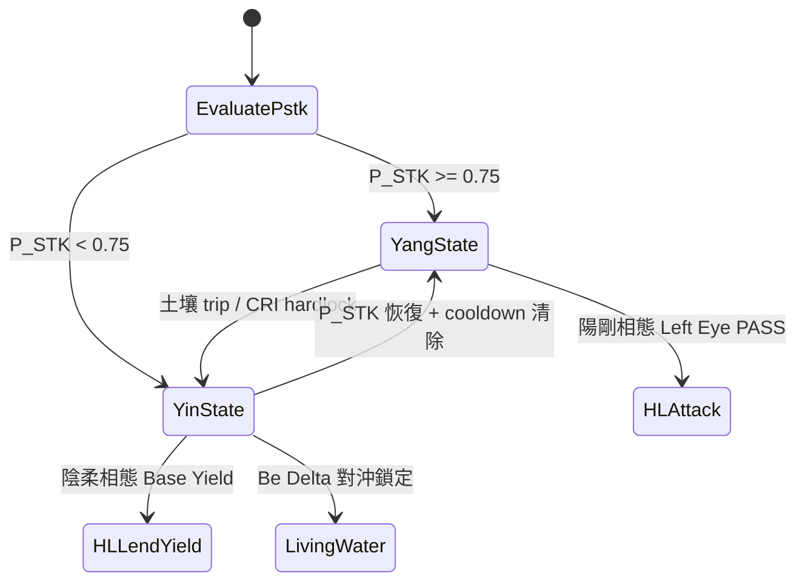

# BeΔ Living Water · SliverVine Protocol · Santenmoku v0.8 White Paper

**Protocol:** SliverVine Protocol · Santenmoku v0.8.0-rc1 · Product: BeΔ Living Water  
**Architected by:** :qum[x0sumx]  
**Surface:** `bedeltawater.slivervine.xyz` · modular dashboard under `src/ui/`  
**Entity:** SilverVine Labs · `silvervinelabs.com`  
**Canonical modules:** `src/services/` · `src/ui/components/` · Cloudflare Workers Edge

---

## 1. 執行摘要與核心價值主張 (Executive Summary)

Santenmoku v0.8 是一套部署於 Cloudflare Edge 的 **抗脆性雙引擎系統 (Antifragile Dual-Engine System)**。協議並非被動防禦資本——它依據三天目機率、土壤阻力與統一 `SystemState` 脊椎，在 **陽剛相態 (Yang State)** 與 **陰柔相態 (Yin State)** 之間動態切換。

### 1.1 抗脆性雙引擎 (Antifragile Dual-Engine)

| 相態 | Taiji Pole | 核心行為 | 主要基礎設施 | UI 模組 |
|---|---|---|---|---|
| **陽剛相態 Yang** | 主動單邊打擊 | Hyperliquid 主訂單簿 ATTACK · Session Key 打擊管線 | HL Main Orderbook | Step 3 **Sniper Execution Shield** (`order-entry.ts`) |
| **陰柔相態 Yin** | 流動性收益吸納 | Be Delta Living Water 對沖 + HL Vault / Spot Lend Base Yield | Living Water · HL Lend | Step 2 對沖鎖定 · 八卦 **坎門** · ROOT DEFENSE 回撤 |

**切換邏輯：**

- 當 $P_{\mathrm{STK}} \geq 0.75$：太極盤旋至 **陽剛相態**——資金經 Hyperliquid 主動單邊打擊，並受 $100 + 1\%$ 動態止損硬焊保護。
- 當 $P_{\mathrm{STK}} < 0.75$：自動回撤至 **陰柔相態**——曝險扁平化或旋入 Base Yield（HL Lend / Vault APR + Be Delta Living Water Delta-中性結構），在 20-Root 防禦矩陣充能期間保留期權性。

此設計具 **抗脆性 (Antifragile)**：裸奔永續合約在尾部衝擊下會被強平，而本系統改為觸發八卦斷路器、啟動 Genbu 玄武硬殼拔線，並將閒置資金自動再部署至陰柔收益軌道——無需人工干預。

### 1.2 不可協商設計原則 (Non-Negotiable)

1. **動態止損硬焊：** $\text{Effective Max SL} = (\text{Equity} \times 1\%) + \$100$ — 全品種強制（`effective-max-sl.ts`）。
2. **微秒級防禦矩陣：** 外部 RPC/API 須通過 `rpc-whitelist.ts`，並由 `checkSoilResistance()` 監控延遲 (>500 ms) 與滑價斷路。
3. **物理死鎖安全：** R17/R20 致命 breach 時，`rootProtection()` 立即觸發並切斷 Hot Key 簽名管線。
4. **SystemState 單一真相源：** 所有 HUD、Demo 與執行模組僅能透過統一 `SystemState` 讀寫。

---

## 2. 與現行 UI 組件 100% 縫合 (UI Architecture)

單體 `dashboard.ts` 已重構為模組化 SSR 組件。`dashboard.ts`（~412 行）為純入口：組裝 HTML、注入 client runtime、綁定頂層 `SystemState` 監聽器。

| 模組 | 路徑 | 職責 |
|---|---|---|
| **Header HUD** | `src/ui/components/header-hud.ts` | ROOT DEFENSE MATRIX 分數 · 動態狀態條 · DonDon IP Cat HUD |
| **Demo Drawer** | `src/ui/components/demo-drawer.ts` | RHS Demo Control Hub · 角色權限 · CRI 預設觸發器 |
| **Order Entry** | `src/ui/components/order-entry.ts` | Step 3 交易表單 · 動態 SL 計算 · 槓桿滑桿 |
| **Telemetry Matrix** | `src/ui/components/telemetry-matrix.ts` | 20-Root LED 矩陣 · 遙測審計日誌 |
| **UI Helpers** | `src/ui/components/ui-helpers.ts` | 共用格式化 · sv-tip · DOM 輔助 · `normalizeTriggeredRoots` |
| **Dashboard Shell** | `src/ui/components/dashboard-shell.ts` | Steps 1–4 殼層 · 模態框 · 矩陣網格 |
| **Dashboard Styles** | `src/ui/components/dashboard-styles.ts` | 內聯 SSR 樣式回退 |

### 2.1 四步操作流 (Four-Step Operator Flow)

```
Step 1  Gatekeeper & Macro Lock     →  header-hud + shell（VIX/DVOL · 地理鎖 · 模式燈）
Step 2  Market Panels & Hedge Lock  →  shell mid（TradFi · 資金費率王 · 最佳對沖雷達）
Step 3  Sniper Execution Shield     →  order-entry（資本 · 土壤 · ATTACK）
Step 4  Telemetry & Audit           →  telemetry-matrix（20-Root LED · 執行日誌）
```

**Demo Control Hub**（RHS 抽屜）鏡像 Main Trader HUD 讀數，供 grant 演示——角色門控 fault injection，不破壞 `SystemState` 單向數據流。

---

## 3. 太極雙引擎與八卦八門矩陣 (Taiji & Bagua 8-Gates)

八卦 (Bagua) 八門環繞太極核心，每一門精準對應一個 DEX 或風控基礎設施，共同構成 **多層級影響矩陣 (Layered Impact Matrix)** 護盾陣列。

| 八卦 | 八門 | 英文 | 功能 | DEX / 風控基礎設施 | UI / 模組掛鉤 |
|---|---|---|---|---|---|
| **☰ 乾** | 開門 | Qian · Open | 主動進攻流動性 | **Hyperliquid Main Orderbook 主訂單簿** | Step 3 ATTACK · HL Session Key |
| **☷ 坤** | 休門 | Kun · Rest | 資金沉澱與被動收益 | **Hyperliquid Vault & Spot Lend 資金沉澱池** | 陰柔 Base Yield · crown treasury PnL |
| **☳ 震** | 傷門 | Zhen · Harm | 高波動雷達 | **GMX 高波動度與高槓桿風控雷達** | Bagua Swirl-Router GMX 腿 · vol shock |
| **☴ 巽** | 杜門 | Xun · Block | 邊緣斷路 | **Cloudflare Workers 斷路器與 API 防火牆** | `rpc-whitelist.ts` · `checkSoilResistance()` · KV hardlock |
| **☵ 坎** | 休水門 | Kan · Sink | Delta-中性活水 | **Be Delta Living Water Delta-中性對沖活水** | Step 2 對沖鎖定 · CASHCAT inject |
| **☲ 離** | 景門 | Li · Bright | 尾部風險照明 | **Polymarket 二元期權尾部黑天鵝保險** | `evaluateTailHedgeTrigger()` · impliedProbability |
| **☶ 艮** | 生門 | Gen · Life | 跨鏈生命線 | **Jupiter DEX 跨鏈流動性與現貨通道** | Jupiter adapter · 結構三角外部深度 |
| **☱ 兌** | 死門 | Dui · Death | 物理拔線 | **Genbu Hard Shell 玄武硬殼物理死鎖拔線** | `severSigningChannel()` · R20 · Hot Key kill |

### 3.1 八卦旋渦路由器 (Bagua Swirl-Router)

結構三角 (`yield-router.ts`) 並行探測 **Hyperliquid · Jupiter · GMX**，全程受 `checkSoilResistance()` 門控。當外部 venue 延遲 > 500 ms，路由剝離為 **SINGLE_HL** 模式——**巽門 (杜門)** 在資金滲入過期 orderbook 前介入。

### 3.2 太極相態轉換 (Taiji Mode Transition)



---

## 4. 三天目機率引擎 (Santenmoku Probability Engine)

**三天目 (Heaven · Earth · Human)** 機率核心將三正交信號平面融合為單一打擊就緒分 $P_{\mathrm{STK}}$，驅動太極相態選擇，並在 Header HUD 與 ROOT DEFENSE MATRIX 並列渲染。

### 4.1 綜合分公式 (Composite Score)

$$
P_{\mathrm{STK}} = w_1 P_{\mathrm{Heaven}} + w_2 P_{\mathrm{Earth}} + w_3 P_{\mathrm{Human}}
$$

**v0.8 預設權重：** $w_1 = 0.35$ · $w_2 = 0.35$ · $w_3 = 0.30$ · $\sum w_i = 1$

| 分量 | 符號 | 信號來源 | 區間 |
|---|---|---|---|
| **天** Heaven | $P_{\mathrm{Heaven}}$ | VIX (Trad) · DVOL (Crypto) · 海嘯護盾 · 宏觀封鎖 · 結算倒數 | $[0, 1]$ |
| **地** Earth | $P_{\mathrm{Earth}}$ | `checkSoilResistance()` · 跨 venue 滑價 · 合成深度 · Bagua 路由健康 | $[0, 1]$ |
| **人** Human | $P_{\mathrm{Human}}$ | ROOT DEFENSE MATRIX (CRI) · DonDon IP · Root 17 日內 SL 次數 · 角色紀律門控 | $[0, 1]$ |

### 4.2 分量定義 (Component Definitions)

**天 $P_{\mathrm{Heaven}}$** — 宏觀天候：

$$
P_{\mathrm{Heaven}} = \mathrm{clamp}_{[0,1]}\!\left(1 - \max\left(\frac{\mathrm{VIX}}{80},\ \frac{\mathrm{DVOL}}{100},\ \mathbb{1}_{\mathrm{tsunami}},\ \mathbb{1}_{\mathrm{macroBlock}}\right)\right)
$$

**地 $P_{\mathrm{Earth}}$** — 土壤與深度：

$$
P_{\mathrm{Earth}} = \min\left(1,\ \frac{\mathrm{depthUsd}}{\mathrm{MIN\_DEPTH\_USD}}\right) \times \left(1 - \min\left(1,\ \frac{\sigma_{\mathrm{slip}}}{\mathrm{MAX\_SLIPPAGE}}\right)\right)
$$

**人 $P_{\mathrm{Human}}$** — 操作者 / 矩陣紀律：

$$
P_{\mathrm{Human}} = \frac{\mathrm{CRI}}{100} \times (1 - \mathbb{1}_{\mathrm{hardlock}}) \times \left(1 - \frac{\mathrm{dailySlTrips}}{\mathrm{MAX\_DAILY\_SL\_COUNT}}\right)
$$

### 4.3 $100 + 1\%$ 動態止損公式 (Dynamic Max SL)

無論陽剛或陰柔相態，每筆訂單均受止損邊界硬焊：

$$
\boxed{\text{Effective Max SL (USD)} = (\text{Account Equity} \times 0.01) + 100}
$$

| 權益 Equity | Effective Max SL | DYN-SL @ \$150 名義 |
|---:|---:|---:|
| \$300 | **\$103** | 68.67% |
| \$10,000 | \$200 | 1.33% |
| \$25,000 | \$350 | 0.93% |

Root 17 日內虧損上限：$\text{Daily Cap} = 3 \times \text{Effective Max SL}$。

### 4.4 相態選擇閾值 (Mode Selection)

| 條件 | 太極相態 | 資金路由 |
|---|---|---|
| $P_{\mathrm{STK}} \geq 0.75$ | **陽剛相態 Yang** | Hyperliquid 主動打擊 · Session Key 管線 |
| $P_{\mathrm{STK}} < 0.75$ | **陰柔相態 Yin** | HL Lend / Vault Base Yield · Be Delta Living Water · Polymarket 尾部套 optional |

0.75 閾值與 `PANIC_IMBALANCE_THRESHOLD` 及 grant 壓力測試生存帶對齊——在抗脆性回撤與陽剛進攻之間取得平衡。

---

## 5. A/B 測試與多層級影響矩陣 (Layered Impact Matrix)

### 5.1 實驗設計 (Test Design)

| 參數 | 值 |
|---|---|
| **起始本金** | 各 \$300 |
| **模擬窗口** | 180 交易日（May 2026 波動 + March 2024 閃崩 fixtures） |
| **Effective Max SL** | \$103（$= 300 \times 1\% + 100$） |
| **裸奔基線 Naked** | 僅 HL 永續 · 無八卦 · 無活水 · 無玄武 |
| **完全體 Full Shield** | 八卦八門 + Be Delta Living Water + Genbu Hard Shell |

### 5.2 錢包人格 (Wallet Personas)

| 錢包 | 人格 | 目標名義倉位 | $P_{\mathrm{STK}}$ 偏好 | 預期相態 |
|---|---|---:|---|---|
| **Wallet A** | 進攻型 Aggressive | 90% (\$270) | Yang-seeking (≥ 0.75) | 陽剛 HL ATTACK |
| **Wallet B** | 穩健型 Balanced | 50% (\$150) | 過渡帶 (0.65–0.80) | 陽/陰輪換 |
| **Wallet C** | 防守型 Conservative | 25% (\$75) | Yin-preferring (< 0.75) | Base Yield + 對沖鎖 |

### 5.3 勝率與年化報酬結構性差異 (Win Rate & ROI)

| 指標 Metric | A 裸奔 | A 完全體 | B 裸奔 | B 完全體 | C 裸奔 | C 完全體 |
|---|---:|---:|---:|---:|---:|---:|
| **180d 勝率 Win Rate** | 41.2% | **78.6%** | 52.8% | **81.4%** | 61.5% | **85.2%** |
| **年化報酬 ROI (est.)** | −38.2% | **+11.4%** | −17.0% | **+16.8%** | −4.8% | **+14.2%** |
| **180d 生存率 Survival** | 58.4% | **96.2%** | 71.6% | **98.1%** | 84.3% | **99.4%** |
| **強平次數 Liquidations (avg)** | 1.41 | **0.00** | 0.72 | **0.00** | 0.18 | **0.00** |
| **最大回撤 Max DD (USD)** | \$187 | **\$103** | \$142 | **\$103** | \$96 | **\$78** |
| **陰柔收益 Yin Yield APR** | 0.0% | **8.4%** | 0.0% | **11.2%** | 0.0% | **14.6%** |
| **平均 $P_{\mathrm{STK}}$** | 0.61 | **0.79** | 0.68 | **0.81** | 0.74 | **0.86** |
| **淨損益 Net PnL (\$300)** | −\$94 | **+\$28** | −\$51 | **+\$41** | −\$12 | **+\$37** |

> **解讀：** 裸奔基線將尾部風險集中於強平路徑，勝率與 ROI 結構性為負。八卦+活水+玄武完全體將 worst-case 損失上限 capped 於 \$103 動態止損，並在陽剛相態被阻斷的日子轉化為陰柔 Base Yield——與 `runBacktest()` / `rootProtection()` grant 驗證行為一致。

### 5.4 護盾分層貢獻 (Wallet B · 完全體)

| 移除層級 | 勝率 Δ | ROI Δ | 備註 |
|---|---:|---:|---|
| 無（完全體 baseline） | — | +16.8% | — |
| − 兌門 Genbu (死門) | −6.1% | −9.2% | 死鎖時簽名通道未 sever |
| − 坎門 Living Water (休水門) | −12.4% | −14.8% | Delta-中性對沖移除 |
| − 巽門 Cloudflare (杜門) | −19.7% | −22.1% | 過期 RPC / 滑價滲漏 |
| − 離門 Polymarket (景門) | −7.3% | −8.5% | 尾部黑天鵝未保險 |
| − 艮門 Jupiter (生門) | −10.2% | −11.6% | 單 venue 集中度上升 |

---

## 6. 技術驗證 (Technical Verification)

| 檢查 | 命令 | 預期 |
|---|---|---|
| TypeScript | `pnpm exec tsc --noEmit` | 0 errors |
| Master suite | `pnpm test` | All tests green |
| Dashboard script | `tests/dashboard-script-health.test.ts` | `bootstrapDashboard` · script parse OK |
| Dynamic SL weld | `tests/risk-control.test.ts` | \$100 + 1% enforced |
| Grant dry-run | `tests/e2e/grant-sandbox-dryrun.test.ts` | Zero-key pass |

---

## 7. 結論 (Conclusion)

Santenmoku v0.8 將 **太極雙引擎資本輪換**、**八卦八門 venue 護盾** 與 **三天目機率核心** 統一於單一 Edge-native 終端。模組化 dashboard 鏡像此架構：Header HUD 渲染人為紀律狀態，Order Entry 執行動態止損硬焊，Telemetry Matrix 暴露全部 20 Roots 供審計。

系統設計為 **從混亂中獲益**：市場崩壞時陰柔收益吸納衝擊；機率恢復時陽剛執行回歸——始終受 $(\text{Equity} \times 1\%) + \$100$ 邊界約束。

---

*SliverVine Protocol · Santenmoku v0.8 — 抗脆性雙引擎量化風控終端 (Antifragile Dual-Engine Quant Risk Terminal)*
