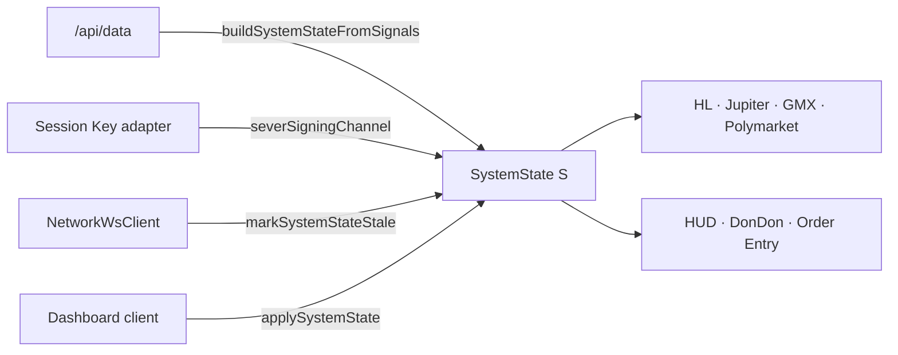
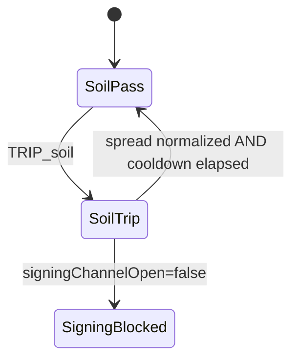
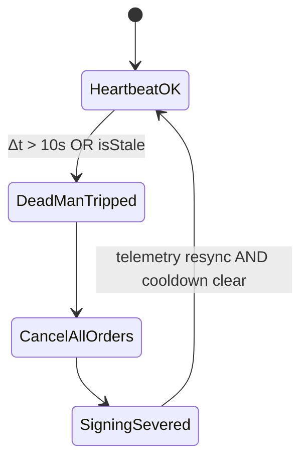
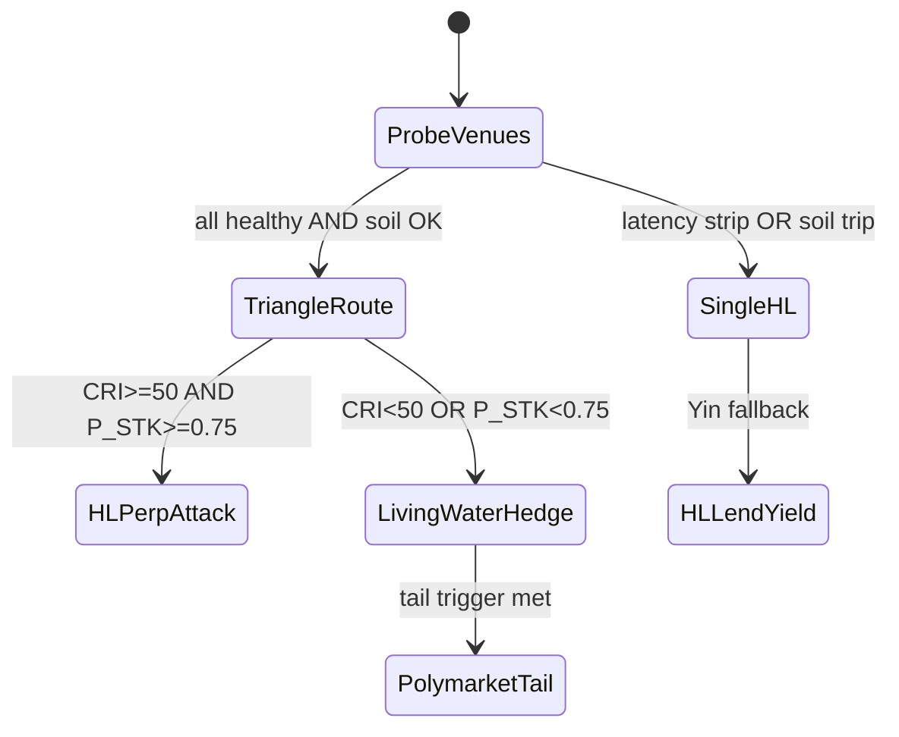

# SliverVine Protocol · Santenmoku v0.8 Yellow Paper

**Document class:** Formal specification (mathematics · state machines · access control)  
**Protocol:** SliverVine Protocol · Santenmoku v0.8.0-rc1  
**Canonical modules:** `src/core/state.ts` · `src/services/systemState.ts` · `src/services/cri-engine.ts` · `src/services/criEngine.ts` · `src/services/risk-control.ts` · `src/services/rootProtectionService.ts` · `src/v2/services/demo-roles.ts`

---

## 0. Notation

| Symbol | Domain | Meaning |
|---|---|---|
| $B$ | $\mathbb{R}_{\geq 0}$ | Account balance / equity (USD) |
| $\mathrm{CRI}$ | $[0, 100]$ | Cybernetic Risk Index (ROOT DEFENSE MATRIX score) |
| $\mathcal{R}$ | $\{1,\ldots,20\}$ | Root index set |
| $\mathrm{SL}_{\max}$ | $\mathbb{R}_{>0}$ | Dynamic Max SL (USD) |
| $\sigma$ | $\mathbb{R}_{\geq 0}$ | Slippage ratio (dimensionless) |
| $D$ | $\mathbb{R}_{\geq 0}$ | Order-book depth (USD) |
| $\mathcal{S}$ | `SystemState` | Authoritative runtime snapshot |

All UI surfaces, API handlers, and client scripts **must** read and mutate risk posture exclusively through $\mathcal{S}$ (`buildSystemState` · `updateSystemState` · `applySystemState`).

---

## 1. SystemState — Single Source of Truth（單向數據流 SSOT）

**Principle:** All risk posture reads and writes flow unidirectionally through $\mathcal{S}$. No module may maintain a parallel CRI, hardlock, or signing-channel flag.

### 1.1 State Vector

$$
\mathcal{S} = \langle B,\ \mathrm{CRI},\ \mathrm{SL}_{\max},\ h,\ \lambda,\ \kappa,\ \mu,\ \zeta \rangle
$$

| Field | Type | Definition |
|---|---|---|
| `accountBalanceUsd` | $B$ | Vault / equity balance |
| `currentCri` | $\mathrm{CRI}$ | ROOT DEFENSE MATRIX score |
| `dynamicMaxSL` | $\mathrm{SL}_{\max}$ | Welded per-order loss ceiling |
| `hudState` | $\in \{\texttt{IDLE},\texttt{GREEN},\texttt{AMBER},\texttt{SANTENMOKU},\texttt{BLOCKED}\}$ | DonDon / banner posture |
| `hardlock` | $\lambda \in \{0,1\}$ | Physical deadlock (HTTP 403) |
| `signingChannelOpen` | $\kappa \in \{0,1\}$ | Hot Key / Session Key pipeline |
| `isSandboxMode` | $\mu$ | Zero-key dry-run flag |
| `isStale` | $\zeta$ | WS / telemetry stale lockout |

**Invariants:**

$$
\lambda = 1 \implies \mathrm{CRI} = 0 \land \kappa = 0
$$

$$
\kappa = 1 \iff \neg\lambda \land \mathrm{CRI} > 0 \land \neg\zeta
$$

$$
\mathrm{SL}_{\max} = f(B) \quad \text{(recomputed on every state build)}
$$

### 1.2 State Transition Algebra

Let $\delta(\mathcal{S}, \pi)$ denote `updateSystemState({ patch: π })`.

$$
\delta(\mathcal{S}, \pi) = \texttt{buildSystemState}(\pi) \oplus \pi \oplus \texttt{resolveHudState}(\mathrm{CRI}', \lambda')
$$

where $\oplus$ is field-wise merge with `resolveHudState` override.

**Allowed mutation paths:**

| Producer | Operation | Fields touched |
|---|---|---|
| `/api/data` | `buildSystemStateFromSignals` | $\mathrm{CRI}, h$ |
| Session Key adapter | `severSigningChannel` | $\mathrm{CRI}\!\leftarrow\!0, \lambda\!\leftarrow\!1, \kappa\!\leftarrow\!0$ |
| WS client | `markSystemStateStale` | $\zeta\!\leftarrow\!1, \kappa\!\leftarrow\!0$ |
| Dashboard client | `applySystemState(res.systemState)` | Full vector sync |

**Forbidden:** parallel CRI stores, ad-hoc `lastRiskScore`, or module-local hardlock flags outside $\mathcal{S}$.

### 1.3 Unidirectional Flow Axioms

$$
\text{read}(\text{module}) \rightarrow \texttt{readActiveSystemState()} \lor \texttt{buildSystemState}(\cdot)
$$

$$
\text{write}(\text{module}, \pi) \rightarrow \texttt{updateSystemState}(\{\texttt{patch}: \pi\}) \lor \texttt{applySystemState}(\mathcal{S}')
$$



**Merge law** (`core/state.ts` · `updateSystemState`):

$$
\kappa' = \neg(\lambda' \lor \mathrm{CRI}' \leq 0) \land \neg\zeta' \quad \text{(unless explicit patch override)}
$$

---

## 2. Dynamic Max SL — Formal Derivation（動態止損公式）

### 2.1 Definition

From `effective-max-sl.ts` / `risk-control.ts`:

$$
\boxed{\mathrm{SL}_{\max}(B) = B \cdot r + b}
$$

where:

- $r = 0.01$ (`DYNAMIC_MAX_SL_BALANCE_RATE`)
- $b = 100$ USD (`DYNAMIC_MAX_SL_BASE_USD`)

Equivalently:

$$
\mathrm{DynamicMaxSL} = \mathrm{AccountBalance} \times 0.01 + 100
$$

### 2.2 Domain Constraints

$$
B \leftarrow \max(0,\ B) \quad \text{(negative equity clamped)}
$$

$$
\mathrm{SL}_{\max}(0) = 100 \quad \text{(base tier floor)}
$$

### 2.3 Per-Order Stop Percentage

Given order notional $N > 0$:

$$
\mathrm{DYN\text{-}SL\%}(N, B) = \frac{\mathrm{SL}_{\max}(B)}{N} \times 100
$$

### 2.4 Root 17 Daily Loss Cap

$$
\mathrm{DailyCap}(B) = 3 \cdot \mathrm{SL}_{\max}(B)
$$

$$
\mathrm{MaxDailySlTrips} = 3 \quad \text{(`MAX\_DAILY\_SL\_COUNT`)}
$$

---

## 3. CRI (Cybernetic Risk Index) Scoring（ROOT DEFENSE MATRIX）

CRI is isomorphic to the **ROOT DEFENSE MATRIX** score (`cri-engine.ts` · `calculateRootDefenseMatrixScore`). Signal-derived CRI uses tiered penalties via `criEngine.ts` · `deriveCriFromRiskSignals`. Direction: **100 = healthy → 0 = physical deadlock**.

### 3.1 Tier Penalty Function

Let $T(r)$ denote tier of root $r$:

| Tier | Roots | Penalty $p(r)$ |
|---|---|---:|
| 1 | R1–R5 | 5 |
| 2 | R6–R10 | 12 |
| 3 | R11–R15 | 25 |
| 4 | R16–R20 | $\infty$ (fatal veto) |

Given triggered set $\mathcal{T} \subseteq \mathcal{R}$:

$$
\mathrm{score}(\mathcal{T}) =
\begin{cases}
0 & \text{if } \exists r \in \mathcal{T} : T(r) = 4 \\[4pt]
\max\!\left(0,\ 100 - \displaystyle\sum_{r \in \mathcal{T}} p(r)\right) & \text{otherwise}
\end{cases}
$$

Implementation: `calculateRootDefenseMatrixScore(normalizeTriggeredRoots(𝒯))`.

### 3.2 Status Bands

$$
\mathrm{band}(s) =
\begin{cases}
\texttt{OPTIMAL} & s \geq 80 \\
\texttt{ELEVATED} & 50 \leq s < 80 \\
\texttt{CRITICAL} & s < 50
\end{cases}
$$

### 3.3 Demo Hub Preset → CRI Mapping（UI Presets 精準映射）

Presets (`setDemoCriPreset` · `demo-drawer.ts`) inject deterministic root trips via `applyDemoRootTrips(rootNums)`:

| Preset | Target CRI | Triggered Roots | Execution Posture |
|---|---:|---|---|
| **NOMINAL** | **100** | $\varnothing$ (all PASS) | Full Yang / offensive execution · Session Key armed · $\kappa = 1$ |
| **WARNING** | **48 → band 50** | R11, R6, R1, R2, R3 | Size halved · slippage fuse tightened to `VINE_SOIL_MAX_SLIPPAGE = 0.3%` · `hudState = AMBER` |
| **TOXIC** | **20** | R11, R12, R13, R1 | Restricted Hot Key signing · Santenmoku armor armed · Toxic Mode cooldown (`TOXIC_MODE_COOLDOWN_MS = 60s`) |
| **DEFCON 1 (GOD)** | **0** | R1–R20 all TRIPPED | Genbu Shell (玄武) physical deadlock · `severSigningChannel()` · hard execution kill |

**WARNING penalty proof:**

$$
100 - (p_{11} + p_6 + p_1 + p_2 + p_3) = 100 - (25 + 12 + 5 + 5 + 5) = 48
$$

UI displays **50** as the WARNING band label (`STATUS_DICTIONARY.DEMO_HUB.CRI_CONTROL.presets.WARNING`); computed score 48 maps to `AMBER` via `resolveHudState` ($\mathrm{CRI} \leq 50$).

**TOXIC penalty proof:**

$$
100 - (25 + 25 + 25 + 5) = 20
$$

**DEFCON 1:** any Tier-4 root in $\mathcal{T}$ ⇒ $\mathrm{score} = 0$ immediately (fatal veto branch).

### 3.5 Preset → Execution Posture Algebra

Let $N$ denote requested order notional and $\mathrm{CRI}$ the active score:

$$
N_{\mathrm{eff}}(\mathrm{CRI}, N) =
\begin{cases}
N & \mathrm{CRI} > 50 \quad \text{(NOMINAL / GREEN)} \\[4pt]
\lfloor N / 2 \rfloor & 20 < \mathrm{CRI} \leq 50 \quad \text{(WARNING / AMBER)} \\[4pt]
0 & \mathrm{CRI} \leq 20 \quad \text{(TOXIC — `resolveAttackLock` → TOXIC\_MODE)} \\[4pt]
0 & \mathrm{CRI} = 0 \quad \text{(DEFCON 1 — hardlock)}
\end{cases}
$$

Slippage fuse override at WARNING:

$$
\sigma_{\max} \leftarrow
\begin{cases}
0.005 & \mathrm{CRI} > 50 \\
0.003 & 20 < \mathrm{CRI} \leq 50 \quad \text{(`checkSoilResistanceWithVine`)}
\end{cases}
$$

Signing channel:

$$
\kappa =
\begin{cases}
1 & \mathrm{CRI} > 0 \land \neg\lambda \land \neg\zeta \land \neg\text{ToxicCooldown} \\
0 & \text{otherwise}
\end{cases}
$$

### 3.4 CRI → HUD State Map

From `resolveHudState(currentCri, hardlock)`:

| Condition | `hudState` | DonDon IP |
|---|---|---|
| $\lambda = 1 \lor \mathrm{CRI} = 0$ | `BLOCKED` | HARD_LOCK / GOD_MODE |
| $\mathrm{CRI} \leq 25$ | `SANTENMOKU` | LEVEL_UP / ORANGE_TARGET |
| $\mathrm{CRI} \leq 50$ | `AMBER` | WARNING |
| $\mathrm{CRI} \leq 85$ | `GREEN` | NORMAL / SHIELD |
| else | `GREEN` | NORMAL |

---

## 4. Circuit Breaker Logic & 20-Root Matrix（斷路器 · 根系矩陣）

### 4.0 Twenty-Root Index（R1–R20）

| Root | Tier | Penalty | Canonical Label |
|---:|---:|---:|---|
| R1 | 1 | 5 | Max Loss Weld (Dynamic SL) |
| R2 | 1 | 5 | Geo Jurisdiction Lock |
| R3 | 1 | 5 | `checkSoilResistance()` |
| R4 | 1 | 5 | Close Spike Window |
| R5 | 1 | 5 | VIX / DVOL Macro Fuse |
| R6 | 1 | 5 | Beginner Cap Gate & Preset Modes |
| R7 | 2 | 12 | Pre-Calculated Risk Boundary Lock |
| R8 | 2 | 12 | Slippage Circuit Breaker (0.5%) |
| R9 | 2 | 12 | Cross-Venue Funding Variance |
| R10 | 2 | 12 | Settlement Window Lock |
| R11 | 3 | 25 | Crowded Position / Squeeze Detector |
| R12 | 3 | 25 | Spot–Perp Basis Validator |
| R13 | 3 | 25 | Session Key Signature Gate |
| R14 | 3 | 25 | Client Order ID (ClOID) Dedup |
| R15 | 3 | 25 | Cross-Chain Gas / Fee Friction |
| R16 | 4 | $\infty$ | Top-of-Book Depth Cap (1%) |
| R17 | 4 | $\infty$ | Daily Loss Limiter (Choice A) |
| R18 | 4 | $\infty$ | Flash Mode Max SL Weld |
| R19 | 4 | $\infty$ | Fill Tracking / Latency Telemetry |
| R20 | 4 | $\infty$ | Physical Deadlock / Genbu Shell |

Tier-4 trigger ⇒ immediate $\mathrm{CRI} = 0$ (fatal veto).

### 4.1 Soil Resistance — Slippage Spring (`checkSoilResistance`)

**Inputs:** $(P_{\mathrm{hlSpot}}, P_{\mathrm{hlPerp}}, P_{\mathrm{dydxPerp}}, D, t)$

**Derived slippages:**

$$
\sigma_{\mathrm{cross}} = \frac{|P_{\mathrm{dydxPerp}} - P_{\mathrm{hlPerp}}|}{P_{\mathrm{hlPerp}}}
\quad (\text{if both} > 0)
$$

$$
\sigma_{\mathrm{basis}} = \frac{|P_{\mathrm{hlPerp}} - P_{\mathrm{hlSpot}}|}{P_{\mathrm{hlSpot}}}
\quad (\text{telemetry only})
$$

**Trip predicate** (reason set $\mathcal{C}$):

$$
\text{TRIP}_{\mathrm{soil}} \iff
\underbrace{H_{\mathrm{KT}}(t) \in [21, 23)}_{\text{tsunami shield}} \lor
\underbrace{P_{\mathrm{hlPerp}} \leq 0 \lor P_{\mathrm{dydxPerp}} \leq 0}_{\text{dual venue}} \lor
\underbrace{\sigma_{\mathrm{cross}} > \sigma_{\max}}_{\text{slippage fuse}} \lor
\underbrace{D < D_{\min}}_{\text{depth}}
$$

Constants: $\sigma_{\max} = 0.005$ (`MAX_SLIPPAGE`), $D_{\min} = 100{,}000$ (`MIN_DEPTH_USD`).

**Vine variant:** $\sigma_{\max} \leftarrow 0.003$ (`VINE_SOIL_MAX_SLIPPAGE`).



### 4.2 Root Protection — R17 Daily Loss & R20 Physical Deadlock

**Implementation:** `vineWrapProtection()` (`risk-control.ts`) · alias `rootProtection()` · orchestrated by `checkCircuitBreaker()` (`rootProtectionService.ts`).

**Loss gate (per-order):**

$$
|\hat{L}| > \mathrm{SL}_{\max}(B) \implies \text{throw RiskLimitExceeded (422)}
$$

**CRI hardlock gate (R20 / Genbu Shell):**

$$
\mathrm{CRI} = 0 \implies \text{throw HardlockError (403)} \land \lambda \leftarrow 1 \land \kappa \leftarrow 0
$$

Engagement path: `severSigningChannel()` → `updateSystemState({ patch: { currentCri: 0, hardlock: true, signingChannelOpen: false } })`.

### 4.3 Root 17 — Daily Loss Limiter

State: $\langle d,\ L_{\mathrm{cum}},\ n_{\mathrm{sl}} \rangle$ (UTC day key, cumulative loss, SL trip count).

$$
\text{TRIP}_{R17} \iff L_{\mathrm{cum}} > \mathrm{DailyCap}(B) \lor n_{\mathrm{sl}} \geq 3
$$

On trip: `checkCircuitBreaker` arms 60 s deadlock registry (`DEADLOCK_COOLDOWN_MS = 60{,}000`).

### 4.4 Dead-Man's Switch (Heartbeat Supervisor · 微秒級心跳)

**Supervisor deadline:**

$$
T_{\mathrm{dead}} = 10{,}000\ \text{ms}
$$

**Heartbeat sources:**

| Source | Interval | Stale threshold | Module |
|---|---|---|---|
| Operator session (`FOMO_ACTION_WINDOW_MS`) | rolling 10 s | $> 5$ actions ⇒ Hot Key lock | `rootProtectionService.ts` |
| Network WS (`NETWORK_WS_HEARTBEAT_MS`) | 3 s ping | inbound gap $> 5$ s ⇒ `isStale` | `network/ws-client.ts` |
| KV telemetry (`SYSTEM_HEARTBEAT`) | Edge write | missing $> T_{\mathrm{dead}}$ ⇒ stale | `kv-store.ts` |

**Composite trigger:**

$$
\text{TRIP}_{\mathrm{deadman}} \iff (t - t_{\mathrm{lastHeartbeat}} > T_{\mathrm{dead}}) \lor \zeta = 1
$$

**Actions on trip (ordered, mandatory):**

1. $\texttt{CancelAllOrders()}$ — HL session cancel pipeline (`session-key-adapter.ts`) / toxic modal force-close copy
2. $\kappa \leftarrow 0$ — `markSystemStateStale({ patch: { isStale: true, signingChannelOpen: false } })`
3. Append `SYSTEM_STALE` to state transaction log (`state/system-state.ts`)
4. If $\mathrm{CRI} = 0$: $\texttt{severSigningChannel()}$ — Genbu (玄武) physical unplug



### 4.5 Vine Mesh Auto-Recovery (Soft R20)

Soft deadlock: $\kappa = 0 \land \lambda = 0 \land \mathrm{CRI} > 0$.

Recovery requires:

$$
(t - t_{\mathrm{violation}} \geq 180\ \text{s}) \land (\sigma_{\mathrm{spread}} < 0.001)
$$

Then $\kappa \leftarrow 1$ (`vineMeshAutoRecovery`).

---

## 5. Multi-DEX Routing Algebra & State Machine（多 DEX 路由代數）

### 5.1 Venue State Space

$$
\mathcal{V} = \{\texttt{HL\_PERP},\ \texttt{HL\_LEND},\ \texttt{LIVING\_WATER},\ \texttt{POLYMARKET}\}
$$

| Venue ID | Protocol Surface | Role |
|---|---|---|
| `HL_PERP` | Hyperliquid L1 Perps | Yang offensive / directional attack |
| `HL_LEND` | Hyperliquid Vault Lend | Idle capital yield sleeve |
| `LIVING_WATER` | Be Delta Living Water | Delta-neutral CASHCAT / REVERSE_CASHCAT hedge |
| `POLYMARKET` | Polymarket CLOB | Binary tail-risk / black-swan insurance |

Capital vector: $\vec{c} \in \mathbb{R}_{\geq 0}^{|\mathcal{V}|}$ with $\sum c_i = B$.

### 5.2 Routing Decision Function

$$
\text{route}(B,\ \mathrm{CRI},\ P_{\mathrm{STK}},\ \text{soil}) \rightarrow \vec{c}
$$

**Yang branch** ($\mathrm{CRI} \geq 50$ and $\neg\text{TRIP}_{\mathrm{soil}}$):

$$
c_{\texttt{HL\_PERP}} \leftarrow N_{\mathrm{order}}, \quad c_{\texttt{HL\_LEND}} \leftarrow B - N_{\mathrm{order}}
$$

**Yin branch** ($\mathrm{CRI} < 50$ or $\text{TRIP}_{\mathrm{soil}}$):

$$
c_{\texttt{LIVING\_WATER}} \leftarrow \alpha B, \quad c_{\texttt{HL\_LEND}} \leftarrow (1-\alpha) B, \quad c_{\texttt{HL\_PERP}} \leftarrow 0
$$

where $\alpha \in [0.3, 0.7]$ from best-hedge APR ranking (Step 2 lock).

**Tail sleeve** (Polymarket black-swan hedge):

$$
c_{\texttt{POLYMARKET}} > 0 \iff p_{\mathrm{mkt}} \leq \theta_{\mathrm{tail}}
$$

(`evaluateTailHedgeTrigger` · default $\theta_{\mathrm{tail}} = 0.08$ · `DEFAULT_TAIL_HEDGE_THRESHOLD`).

**Dynamic exposure reduction** when tail probability spikes ($p > 0.8$):

$$
E_{\mathrm{poly}}(E_0, p) =
\begin{cases}
E_0 & p \leq 0.8 \\
E_0 \cdot \max\!\left(0.1,\ 1 - \dfrac{p - 0.8}{0.2} \cdot 0.85\right) & p > 0.8
\end{cases}
$$

### 5.3 Structural Triangle (Bagua Swirl-Router)

Parallel probe (`queryStructuralTriangle`):

$$
\text{APY}^* = \arg\max_{v \in \{\texttt{HL},\texttt{JUP},\texttt{GMX}\}} \text{APY}(v) \quad \text{s.t. health}(v) = \texttt{ok}
$$

Latency strip (from `resolveLatencyRoutingMode` · stress-test Scenario C):

$$
\tau_{\mathrm{JUP}} > 500\ \text{ms} \lor \tau_{\mathrm{GMX}} > 500\ \text{ms} \implies \text{mode} = \texttt{SINGLE\_HL}
$$

When stripped: $P_{\mathrm{dydxPerp}} \leftarrow P_{\mathrm{hlPerp}}$ (soil probe collapses to single-venue).



### 5.4 Transition Table

| From | Guard | To | Action |
|---|---|---|---|
| HL Perp | $\text{TRIP}_{\mathrm{soil}}$ | Living Water | Flatten delta · inject CASHCAT hedge |
| HL Perp | $\mathrm{CRI} \to 20$ | Toxic Mode | Cancel all · armor ON · $\kappa$ restricted |
| HL Lend | $\mathrm{CRI} \to 100$ | HL Perp | Unlock ATTACK · Yang Mode |
| Living Water | APR edge lost | HL Lend | Rotate idle capital to vault |
| Any | $\text{TRIP}_{\mathrm{deadman}}$ | Genbu Shell | Cancel all · $\kappa \leftarrow 0$ |
| Any | $p_{\mathrm{mkt}} \leq \theta$ | Polymarket | Allocate tail hedge notional |

---

## 6. Persona Role Access Control（權限隔離矩陣）

Formalized from `demo-roles.ts` · enforced client-side via `canEditRiskPresets` / `canAccessFaultInjection` / `canToggleMasterBreaker` guards.

### 6.1 Role Domain

$$
\mathcal{P} = \{\texttt{TRADER},\ \texttt{AUDITOR},\ \texttt{RISK\_MANAGER}\}
$$

Resolver: `resolveDemoRole(raw)` maps `{JAVIER, risk_manager} → RISK_MANAGER`.

### 6.2 Permission Vector

For role $p \in \mathcal{P}$, define binary capability vector:

$$
\Pi(p) = (r,\ f,\ o,\ e,\ t,\ m) \in \{0,1\}^6
$$

| Index | Capability | `demo-roles.ts` field |
|---|---|---|
| $r$ | readOnly | `readOnly` |
| $f$ | faultInjection | `faultInjection` |
| $o$ | orderEntry | `orderEntry` |
| $e$ | riskPresetOverrides | `riskPresetOverrides` |
| $t$ | telemetryAudit | `telemetryAudit` |
| $m$ | masterBreaker | `masterBreaker` |

**Configuration matrix** (`DEMO_ROLE_CONFIG`):

| Role | $r$ | $f$ | $o$ | $e$ | $t$ | $m$ |
|---|---:|---:|---:|---:|---:|---:|
| TRADER | 0 | 0 | 1 | 0 | 0 | 0 |
| AUDITOR | 1 | 0 | 0 | 0 | 1 | 0 |
| RISK_MANAGER | 0 | 1 | 1 | 1 | 1 | 1 |

### 6.3 Guard Predicates

Runtime guards are pure boolean projections:

$$
\text{canUseOrderEntry}(p) = o \quad \text{where } \Pi(p) = (_,_,o,_,_,_)
$$

$$
\text{canEditRiskPresets}(p) = e
$$

$$
\text{canAccessFaultInjection}(p) = f
$$

$$
\text{canAccessTelemetryAudit}(p) = t
$$

$$
\text{canToggleMasterBreaker}(p) = m
$$

$$
\text{isDemoReadOnly}(p) = r
$$

**Mutation gate (general form):**

$$
\text{allow}(p,\ \text{action}) =
\begin{cases}
0 & \text{if } r = 1 \land \text{action} \notin \{\texttt{read},\ \texttt{audit}\} \\
0 & \text{if } \text{action} = \texttt{preset} \land e = 0 \\
0 & \text{if } \text{action} = \texttt{fault} \land f = 0 \\
0 & \text{if } \text{action} = \texttt{defcon} \land m = 0 \\
1 & \text{otherwise (subject to capability bit)}
\end{cases}
$$

**Example — CRI preset injection:**

$$
\text{setDemoCriPreset}(p,\ \pi) \iff e = 1
$$

Failure emits `[DEMO] Risk preset overrides locked for current persona role`.

### 6.4 Role Lattice

```
RISK_MANAGER (top — full sandbox)
    ├── superset of TRADER capabilities
    └── superset of AUDITOR capabilities
TRADER — order entry only
AUDITOR — read + telemetry audit only (bottom for mutation)
```

### 6.5 Fault Injection Matrix（Risk Manager only）

| Preset ID | Label | Effect |
|---|---|---|
| `HIGH_SLIPPAGE` | Simulate High Slippage > 0.5% | Trips R8 (Tier 2) — soil danger path |
| `TOXIC_OVERLOAD` | Simulate Toxic Overload (CRI 85) | Forces ROOT DEFENSE MATRIX to 20 · Toxic Mode |
| `RESET_TOXIC` | Reset Toxic Circuit Breaker | Clears Toxic Mode override + cooldown |

$$
\text{injectFault}(p, f) \iff f = 1 \land \text{allow}(p, \texttt{fault}) = 1
$$

### 6.6 Security Perimeter Summary

| Guard | TRADER | AUDITOR | RISK_MANAGER |
|---|---|---|---|
| Order entry (`canUseOrderEntry`) | ✓ | ✗ | ✓ |
| CRI preset override (`canEditRiskPresets`) | ✗ | ✗ | ✓ |
| Fault injection (`canAccessFaultInjection`) | ✗ | ✗ | ✓ |
| Telemetry audit (`canAccessTelemetryAudit`) | ✗ | ✓ | ✓ |
| DEFCON 1 toggle (`canToggleMasterBreaker`) | ✗ | ✗ | ✓ |
| Read-only lock (`isDemoReadOnly`) | ✗ | ✓ | ✗ |

---

## 7. Verification

| Check | Command | Expected |
|---|---|---|
| TypeScript | `pnpm exec tsc --noEmit` | 0 errors |
| Unit / stress suite | `pnpm test` | 571+ tests green |
| Dynamic SL weld | `tests/risk-control.test.ts` | $\mathrm{SL}_{\max}(10{,}000) = 200$ |
| CRI preset guards | `tests/demo-roles.test.ts` | Risk Manager-only fault injection |
| Soil resistance | `tests/risk-control.test.ts` | $\sigma > 0.005 \Rightarrow \text{trip}$ |
| Session Key hardlock | `tests/services/session-key-adapter.test.ts` | R20 ⇒ `severSigningChannel` |

---

*SliverVine Protocol · Santenmoku v0.8 Yellow Paper — formal specification for auditors, grant reviewers, and protocol engineers.*
