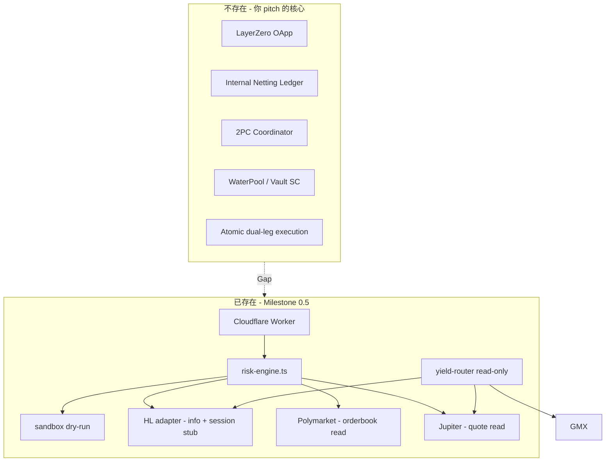

Q.Pgate.md 我唔肯定是否留下做真係有user 做bridge 的時候做protection . 始於這個可能有用. 你點睇 ? and then 呢個除左做跨鏈之外都係做個pool 出來比人收yield 之前同你傾過可行性同安全性都高..只係擔心單腳的出現..你會點防? and then 我認為這個product 更應同polymarket 等預測市場做掛勾.目標係做出high yiled 吸引人來做最好的staking . 引資 if 這個方向清晰.你會有咩建議/反建議. or 你會話我照用 CF 都得都唔mind ..我應該都會比$5 update 做月費.但我唔肯定畲唔會同 HTAC and SLiverwine 撞data . 


[Composer]
# BeDeltaLivingWater — Grant Strategic Review (Round 1 Roast & Audit)

審查基礎：已掃描 repo 結構、`README.md`、`YELLOW_PAPER.md`、`src/services/yield-router.ts`、`src/core/risk-engine.ts`、`src/services/sandbox.ts`、`docs/GRANT_PROPOSAL_HYPERLIQUID.md` 等。以下以 **Grant 審查官 + 資深 Web3 架構師** 視角，對你提出的 **「Yield Engine & Cross-Margin Router (A鏈存/B鏈提 + Δ-Neutral/Polymarket 套利)」** 定位做撕烤式審查。

---

## 0. 先講結論（Executive Verdict）

| 維度 | 評分 | 一句話 |
|------|------|--------|
| Grant 敘事潛力 | **6/10** | 方向對，但 pitch 超前 codebase 至少 2 個 milestone |
| 技術可信度 | **4/10** | 目前是 **Cross-Venue Risk Gate**，不是 Cross-Margin Router |
| 首筆 Grant 可拿性 | **7/10** | 若收斂到 **Hyperliquid Session Key + Yield Read-Path**，有機會 |
| Repo 開源專業度 | **3/10** | Santenmoku 殘留過重，審查員 30 秒內會扣分 |

**最大撕裂點：** 你對外說的是 *Iron Bank / A存B提 / Internal Netting / 2PC*，但 code 實際交付的是 *Pgate 風控沙盒 + 多 venue 報價讀取 + HL Session Key stub*。Grant 審查官不是看 White Paper，是看 **GitHub diff + 一鍵 reproduce**。

---

## 1. Grant 吸引力評估（基金會視角）

### 1.1 各基金會「真正關心什麼」

| 基金會 | 他們的 KPI | 你的定位能否打動？ | 要怎樣講才對味 |
|--------|-----------|-------------------|---------------|
| **Hyperliquid** | HL Lend TVL、OI 深度、Builder 生態、Session Key 安全用法 | **部分能打動** | 別叫 Bridge；叫 **「HL-Native Yield Router + Session-Key Risk Envelope」**——把外部鏈 idle capital **路由回 HL**（Lend/Vault/Perp hedge leg） |
| **Arbitrum** | Arbitrum 上 TVL、GMX/Perp DApp 活躍 | **弱**（除非 GMX leg 是主戰場） | 需證明 **ARB 是 deposit 端或 hedge 端**，不是只讀 `gmx.ts` depth |
| **Solana / Jupiter** | Jupiter 路由量、Solana DeFi composability | **中等** | Jupiter adapter 已有；但要證明 **Sol 端是 capital ingress**，不是 quote API wrapper |
| **LayerZero** | OApp 採用、跨鏈 message volume | **目前零分** | repo 內 **無 LZ 代碼、無 OApp、無 DVN 設計**——不應列為 Wave 1 target |
| **Polymarket** | 預測市場流動性、tail insurance use case | **敘事強、執行弱** | `evaluateTailHedgeTrigger()` 存在，但 **無 CLOB 下單、無 USDC 結算、無 resolution oracle 整合** |

### 1.2 你的新定位 vs 現有 Pitch 的 Gap

Grant proposal 已寫 **「Cross-Chain Net TVL Magnet」** 和 **`delta-vault.ts`**，但：

```bash
# 實際搜尋結果
grep -r "delta-vault\|IronBank\|netting\|2PC" src/  → 0 matches
```

也就是：**Be Δ Living Water 在文件裡是哲學，在 code 裡是空白。**

審查官會問三個問題：
1. **Net New TVL 從哪條鏈進、最終落在 HL 哪個 pool？**（需可驗證 tx / API）
2. **Cross-Margin 的 margin 在哪裡記帳？**（需 on-chain 或 auditable off-chain ledger）
3. **單腳失敗時誰承擔 delta？**（需 2PC / escrow / insurance fund 之一）

目前 `simulateTransactionIntent()` 只證明 **gate pass**，不證明 **capital flow**：

```59:110:tests/e2e/grant-sandbox-dryrun.test.ts
describe("grant sandbox dry-run e2e", () => {
  it("runs HL → Polymarket → Jupiter zero-key auditor sequence with structured audit logs", () => {
    // ... HL / POLY / JUP 各跑一輪 gate diagnostic
    // 沒有 prepare/commit、沒有 ledger debit/credit、沒有 cross-chain message
  });
});
```

### 1.3 什麼敘事 **能** 打動 HL Foundation（建議 Wave 1 主 pitch）

把故事從「我們做跨鏈 Bridge」改成：

> **「Hyperliquid 機構級 Yield Ingress Layer」**  
> 在 Cloudflare Edge 用 Session Key（TRADE_ONLY）+ Dynamic Max SL，把 Solana/Arbitrum 的 **read-path 資本信號** 路由至 HL Lend / Δ-neutral perp hedge，並用 Polymarket tail hedge 做 **非對稱尾部保險 sleeve**。

這與現有 code 重疊度最高：
- `yield-router.ts` → Structural Triangle
- `session-key-adapter.ts` → HL 原生
- `polymarket/index.ts` → tail hedge trigger
- `grant-sandbox-dryrun.test.ts` → auditor 1-minute verify

### 1.4 什麼會 **立刻被 reject**

- **BUSL-1.1**（`LICENSE` + `package.json`）——多數 infra grant 偏好 MIT/Apache；BUSL 需額外解釋 Additional Use Grant
- **品牌混亂**：repo 名 `bedelta-living-water`，package 名 `silvervine-app`，README 標題 **Santenmoku v0.8**
- **過度玄學 UI**：DonDon、八卦八門、20-Root Matrix——對 quant grant 是 **noise**，對 compliance grant 是 **red flag**
- **_claim 0.014ms Edge sync_**——Workers KV 是 eventually consistent，審查員知道這不是 financial-grade ledger

---

## 2. 技術可行性與致命盲點

### 2.1 架構現狀（誠實地畫出來）



### 2.2 「A鏈存 / B鏈提 + Internal Netting + 2PC」的致命盲點

#### A. 跨鏈狀態延遲（Split-Brain）

- HL 是 L1 appchain；Polymarket 在 Polygon；Jupiter 在 Solana
- **Finality 不對稱**：Solana ~400ms、ARB ~250ms、HL block time 不同
- 若 A 鏈 deposit 確認、B 鏈 withdraw 尚未 prepare → **inventory hole**
- 現有 `SystemState` 在 KV，**無 serializable transaction isolation**，不適合作 margin ledger SSOT

#### B. 單腳風險（Leg Risk）——你筆記裡最擔心的

目前 flow 是 **sequential gate check**，不是 **atomic swap**：

```
HL leg OK → Poly leg OK → Jup leg OK   （各自獨立 simulate）
```

真實世界：
- HL perp short 成交了，Polymarket hedge 因 R20 lock 失敗 → **裸 delta**
- Jupiter swap 滑點超標 abort，HL 已開倉 → **單腳**

**2PC 最低要求**（你還沒有）：
1. **Prepare**：兩腿都 lock liquidity / 下 limit + short TTL
2. **Commit**：兩腿都 fill 才 release
3. **Abort**：任一 fail → 全部 rollback / flatten

現有 `vineWrapProtection()` 只管 **loss ceiling**，不管 **delta neutrality**。

#### C. MEV / 執行順序

- `Whale_need.md` 談 Private Relay，code 裡 **無 Flashbots/Jito bundle**
- Polymarket CLOB 是 public mempool；tail hedge 在 black swan 時 **spread 會爆炸**
- HL Session Key 下 IOC 單在 volatile window 可能被 **sandwich**

#### D. 清算風險（Cross-Margin 幻覺）

- HL cross-margin 是 **HL 帳本內** 的概念
- 你把 Jupiter spot + HL perp + Polymarket binary 合成「cross-margin」→ **這是 protocol-level rehypothecation**，不是 venue-native cross-margin
- 需 **獨立 risk engine + haircuts + stress VaR**；現有 CRI/20-Root 是 **trader UX 隱喻**，不是 Basel-style margin model

#### E. Polymarket 套利引擎的特殊坑

| 風險 | 說明 |
|------|------|
| Resolution risk | 市場結算爭議 → hedge leg 不 converge |
| Liquidity cliff | Tail YES < $0.08 時 often **無 ask depth** |
| Capital efficiency | USDC 鎖在 PM 需等 resolution；與 HL margin 周期不匹配 |
| Regulatory | Grant 審查可能問 prediction market exposure 合規邊界 |

#### F. 代碼層面具體問題

1. **Adapter 三重複製**：`services/hyperliquid-adapter.ts`、`services/exchanges/hyperliquid-adapter.ts`、`adapters/hl/`、`adapters/hyperliquid-adapter.ts`
2. **Session Key 是 stub**：`signHyperliquidAction()` 有 EIP-712 envelope，production path 未完整
3. **`ethers` 在 Workers**：違反你 `.cursorrules` 的 pure fetch 原則，增加 bundle size + cold start
4. **`.dashboard-monolith.ts` 10,835 行** 仍在 root——審查員會認為 repo 未整理
5. **v1 (`src/ui/`) + v2 (`src/v2/`) 雙 UI 並存**——維護信號差

---

## 3. 最小可行 Grant Demo（MVP Scope）

目標：**8–12 週拿第一筆 Grant**，建議 **只打 Hyperliquid 一個**，其他 venue 作 read-path 附屬。

### 3.1 只做什麼（IN SCOPE）

| # | 模組 | 交付物 | Grant 可驗證指標 |
|---|------|--------|-----------------|
| 1 | **HL Session Key Risk Envelope** | testnet 真簽名 + TRADE_ONLY + auto-sever on R20 | CI test + 30s screen recording |
| 2 | **Yield Router v0** | `queryStructuralTriangle()` 輸出 **routable yield ranking** + JSON API | `/api/yield/triangle?symbol=ETH` |
| 3 | **Intent Ledger v0** | 單一 Durable Object 或 SQLite-backed ledger：**prepare → commit → abort** 狀態機 | E2E test: dual-leg mock, abort 時 zero net delta |
| 4 | **Polymarket Tail Sleeve (read + simulate)** | 保留 `evaluateTailHedgeTrigger()`，加 **backtest report** | 2024–2025 黑天鵝事件 replay CSV |
| 5 | **Grant Auditor Pack** | 1-command dry-run + 架構圖 1 頁 + milestone table | `pnpm grant:verify` |

### 3.2 砍掉什麼（OUT OF SCOPE for Wave 1）

| 砍掉 | 原因 |
|------|------|
| LayerZero / 真跨鏈 messaging | 0 code；setup 成本 > 一個 grant 周期 |
| A存B提 live mainnet | 需 custody / bridge audit；Wave 2 |
| Full Internal Netting Pool | 需 smart contract + 法律結構；Wave 2–3 |
| DonDon / 八卦 / 20-Root UI | Grant noise；留 internal demo branch |
| `.dashboard-monolith.ts` | 刪或移 `archive/` |
| dYdX / GMX / Orca / Raydium / Camelot 全接 | 只留 triangle 三腿 |
| Whale TWAP / Private Relay production | Wave 2；MVP 用 **simulated bundle** |
| v1 UI (`src/ui/`) | 只留 v2 或只留 API + minimal HUD |

### 3.3 最精簡 MVP 技術路線圖（12 週）

```text
Week 1–2   Repo Rebrand + Structure
           ├─ bedelta-living-water 統一命名
           ├─ packages/* 拆分
           └─ MIT core + BUSL 商業層（或全 MIT 換 grant 友好）

Week 3–4   Intent Ledger + 2PC State Machine (DO/SQLite)
           ├─ states: PENDING → PREPARED → COMMITTED | ABORTED
           ├─ idempotency key per intent
           └─ vitest: 单脚 abort 必须 flatten mock position

Week 5–6   HL Testnet Live Path
           ├─ Session Key 真签名（去 ethers 或 isolate to signing worker）
           ├─ 1 symbol (ETH) delta-neutral: HL perp + mock spot leg
           └─ Dynamic Max SL enforced on every order wire

Week 7–8   Yield Router API + Dashboard
           ├─ GET /api/yield/triangle
           ├─ 最小 React HUD：yield rank + gate status + 2PC timeline
           └─ 删除 DonDon/RootDefense from default route

Week 9–10  Polymarket Tail Backtest Sleeve
           ├─ historical event replay (FTX, Aug 2024 vol spike, etc.)
           └─ report: "tail hedge would have cost X, saved Y"

Week 11–12 Grant Submission Pack
           ├─ HYPERLIQUID grant rewrite（對齊 code，刪除 delta-vault 幻覺）
           ├─ demo video 3 min
           └─ milestone 2 roadmap（LZ + vault SC）作 appendix，不作 claim
```

### 3.4 2PC 防單腳 — MVP 最小設計（給你參考）

```typescript
// 概念 — 不需現在 implement
type IntentPhase = "PREPARE" | "COMMIT" | "ABORT";

interface CrossLegIntent {
  id: string;
  legs: [{ venue: "HL"; side: "SHORT"; sizeUsd: number }, { venue: "POLY"; side: "BUY_YES"; sizeUsd: number }];
  phase: IntentPhase;
  ttlMs: 30_000;
  preparedAt?: number;
}

// Rule: COMMIT 僅當 ALL legs PREPARED && within TTL
// Rule: 任一 PREPARE fail → ABORT + flatten any filled leg (reduce-only)
```

MVP 可 **mock Poly leg**，但 2PC 狀態機必須 **真實存在**——這是 grant 審查員區分「風控 wrapper」和「execution protocol」的分水嶺。

---

## 4. 代碼庫重構建議（Grant-Grade Open Source）

### 4.1 目標結構

```text
bedelta-living-water/
├── README.md                    # BeDelta Living Water — Yield Engine (not Santenmoku)
├── LICENSE                      # MIT (core) 或 dual-license 說明
├── packages/
│   ├── core/                    # SystemState, risk-engine, effective-max-sl
│   │   └── src/
│   ├── adapters/
│   │   ├── hyperliquid/         # 合併現有 4 份 HL 代碼
│   │   ├── jupiter/
│   │   ├── polymarket/
│   │   └── gmx/                 # read-only, optional
│   ├── engine/
│   │   ├── yield-router/        # queryStructuralTriangle
│   │   └── intent-coordinator/  # 2PC state machine (NEW)
│   └── sdk/                     # 給 integrator 的 typed client
├── apps/
│   ├── worker/                  # Cloudflare Worker entry (src/index.ts)
│   └── dashboard/               # v2 React only
├── docs/
│   ├── grant/
│   │   ├── HYPERLIQUID.md       # 對齊 code 的 pitch
│   │   └── SUBMISSION.md        # auditor steps
│   ├── architecture/
│   │   ├── yield-engine.md
│   │   └── intent-2pc.md
│   └── archive/                 # Santenmoku 哲學文檔移入
├── tests/
│   ├── e2e/grant-verify.test.ts
│   └── engine/intent-2pc.test.ts
└── archive/                     # 不刪，但移出主視線
    ├── santenmoku/
    │   ├── dondon/
    │   ├── taiji-bagua.ts
    │   └── dashboard-monolith.ts
    └── legacy_ref/
```

### 4.2 檔案級 Migration Map（精確到現有 path）

| 現有 | 動作 | 新位置 |
|------|------|--------|
| `src/core/*` | move | `packages/core/src/` |
| `src/services/yield-router.ts` | move | `packages/engine/yield-router/` |
| `src/services/exchanges/hyperliquid-adapter.ts` | **merge 唯一 canonical** | `packages/adapters/hyperliquid/` |
| `src/adapters/hyperliquid-adapter.ts` | delete after merge | — |
| `src/services/hyperliquidAdapter.ts` | merge execution wire | same |
| `src/services/sandbox.ts` | move | `packages/core/sandbox/` |
| `src/v2/*` | move | `apps/dashboard/` |
| `src/ui/*` | archive | `archive/santenmoku/ui-v1/` |
| `.dashboard-monolith.ts` | archive | `archive/santenmoku/` |
| `src/services/dondonEngine.ts` 等 | archive | `archive/santenmoku/` |
| `Whale_need.md`, `POPCULTURE_TACTICS.md` | move | `docs/archive/` |
| `dist-worker/` | gitignore | 不進 repo |
| `coverage/` | gitignore | 不進 repo |
| `dashboard-*.gif` (7MB+) | move to `docs/assets/` 或 Git LFS | 減 clone 體積 |

### 4.3 Grant 審查員 30 秒 Checklist

審查員打開 GitHub 時應看到：

- [ ] README 第一句是 **BeDelta Living Water Yield Engine**，不是 Santenmoku
- [ ] `pnpm grant:verify` 一鍵跑通
- [ ] `packages/` 清晰，無 10k 行 monolith
- [ ] CI badge 綠色（已有 `grant-audit.yml`）
- [ ] License 明確（MIT 或 BUSL + grant exception 寫清楚）
- [ ] `docs/grant/SUBMISSION.md` 與 code path **1:1 對應**
- [ ] 無 `dist-worker/index.js` 這種 build artifact
- [ ] Contributing.md + CODEOWNERS（optional but +分）

### 4.4 關於你筆記中的 Q.Pgate

`Pgate.md` **值得保留**，但要 **降維**：

- **保留**：Dynamic Max SL、Session Key sever、soil resistance、rpc whitelist——這是差異化
- **Grant 版改名**：`Production Gate` → **`Risk Envelope`**（少玄學、多 institutional）
- **Bridge protection 角度**：Pgate 適合做 **「執行前風控層」**，不是 bridge 本身；pitch 應說 *「我們不是 bridge，我們是 bridge/yield 路徑上的 mandatory risk envelope」*

Polymarket 掛鉤：**Wave 1 作 tail sleeve simulation**，Wave 2 才 live hedge——否則 grant milestone 無法驗收。

---

## 5. 戰略建議（反/正建議各一）

### 反建議：不要同時衝 4 個 Grant

Hyperliquid + Arbitrum + Solana + LayerZero 四線開戰 = 四份 pitch 都是半真半假。審查官圈子小，**會 cross-reference**。

### 正建議：Hyperliquid 單點突破

用現有最強資產組合：

```
Session Key Safety + Yield Router + 2PC Intent Ledger (mock 2nd leg) + Polymarket tail backtest
```

Grant 標題建議：

> **「BeDelta Living Water: Hyperliquid-Native Yield Ingress & Session-Key Risk Envelope」**

Milestone 2 再寫 LayerZero OApp + WaterPool SC——作 **roadmap appendix**，不作 Wave 1 deliverable。

---

## 6. 風險紅旗摘要（審查官一定會問）

1. **BUSL-1.1** — 能否 fork？能否 commercial use？
2. **Custody** — WaterPool 誰持有 key？是否 MSB/MTL 觸發？
3. **Backtest vs Live** — 398 tests 全是 mock/simulate，live testnet 證據在哪？
4. **Single developer bus factor** — CI 有，但 CODEOWNERS / ADR 呢？
5. **Data collision with HTAC/SilverVine** — 你擔心的 KV namespace / telemetry 若共用同一 CF account，grant 審計會問 **data isolation**；建議 **獨立 wrangler project + KV namespace**

---

若你希望我下一步產出 **Hyperliquid Grant 一頁紙 rewrite（對齊 MVP scope）** 或 **Intent 2PC 狀態機 spec**，可切換到 Agent mode 讓我直接在 repo 裡起草。目前 Ask mode 僅能提供上述戰略與架構審查。

j.
@context 
Phase 3 已成功 push 至 GitHub (`SilverVineLabs/bedelta-living-water`)。現在啟動 Phase 4：【廣義適應性模組開發 (Adaptive Execution Layer)】。

請執行以下工作：

1. 【Polymarket CLOB 即時適應器 (Real-Time Sleeve Integrator)】：
   - 擴充 `src/adapters/polymarket/`，實作極輕量 Orderbook Read-Path 與 Spread/Liquidity Depth 計算。
   - 連結至 `evaluateTailHedgeTrigger()`，確保當 Funding Rate 或標的波動過高時，能自動產出 2PC Intent Leg 準備結構。

2. 【Jupiter Slippage-Protected Route Adapter】：
   - 完善 `src/adapters/jupiter/` 的 Quote 獲取與 Impact 演算，新增動態滑點上限 (Max Allowed Slippage) 檢驗。
   - 確保在 Solana Ingress 過程，若滑點過大時能主動拒絕進入 2PC 階段。

3. 【Rebalancing & Buffer Engine (流動性緩衝與再平衡)】：
   - 在 `src/core/` 新增 `buffer-engine.ts`，計算池子 5%-10% Pre-Hedged Liquidity Buffer 的健康度，並輸出淨值對沖 (Netting Off) 建議。

4. 【自動化測試與整合】：
   - 新增 `tests/core/buffer-engine.test.ts` 與 `tests/adapters/polymarket-realtime.test.ts`，確保與現有 2PC Intent Ledger 相容。

請依序執行，保持 tsc clean 與 100% test pass。

j.
@context 
Phase 4 推進順利完成。現在進入 Phase 5：【DApp Minimal HUD 升級 (apps/dashboard / v2 React)】。

請執行以下工作：

1. 【重構 apps/dashboard 為極簡黑夜機構級 HUD (Stealth Dark Mode)】：
   - 使用 Tailwind / Clean CSS 構建極簡、高 Scannable 的 HUD 介面。
   - 移除任何舊 Santenmoku 殘留 UI 元素，聚焦於 Web3 Quant 終端風格。

2. 【實時動態數據對接 (Yield Triangle & Gate Status)】：
   - 對接 `/api/yield/triangle?symbol=ETH` 接口，展示即時 APY (HL Lend + Funding Rate vs. Jupiter Quote Impact vs. Polymarket Spread)。
   - 整合 Jupiter Ingress Guard 與 Polymarket Realtime Orderbook Guard 的風控燈號 (Green/Amber/Red)。

3. 【2PC Intent Ledger 實時狀態動態視窗 (Live Intent Stream)】：
   - 建立一個實時 Log 流組件，展示 2PC 雙腳狀態機的運作過程（`PENDING → PREPARED → COMMITTED | ABORTED`）。
   - 當模擬或實際觸發 TTL Exceeded 時，高亮顯示 HL `reduce-only flatten` 與 Safe Abort 觸發過程。

4. 【自動化構建與驗證】：
   - 確保 `apps/dashboard` 構建無誤 (`pnpm build` 或 `pnpm preview`)。
   - 確保保持 tsc clean 與 539/539 test suite 通過。

請依序執行並回報成果。