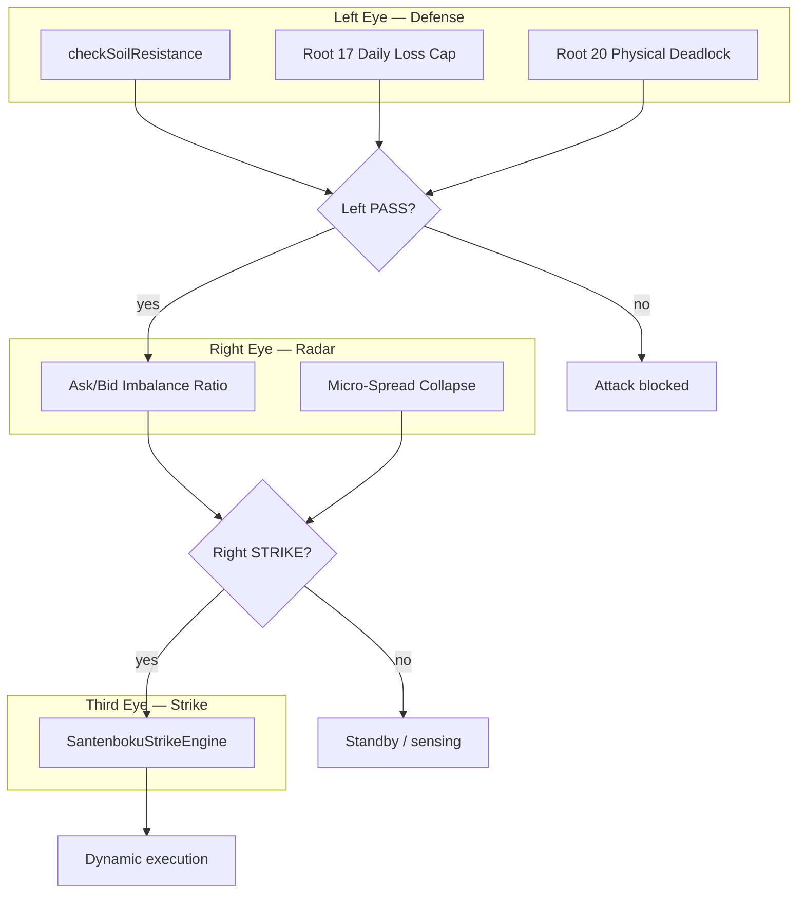
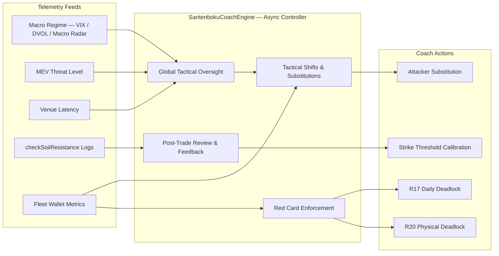

# SilverVine / Santenboku (v0.8) — Protocol Architecture

**攻守一體 (Attack–Defense Integration Engine)**

Santenboku v0.8 unifies defensive hardlocks and offensive strike execution in a single tiered pipeline. Defense always runs first; strike logic is gated and never bypasses the risk engine.

---

## System Boundaries

| Tier | Scope | Repository exposure |
|------|--------|---------------------|
| **Tier 0 — Public UI** | React SPA (`src/v2/`), terminal dashboard, matrix render | Fully open (BSL 1.1) |
| **Tier 1 — Risk Engine** | `checkSoilResistance`, `rootProtection`, Root 17 daily cap, CRI hardlock | Fully structured, unit-tested |
| **Tier 2 — Workers / Adapters** | Cloudflare Worker entry (`src/index.ts`), exchange adapters, matrix pipeline | Interface-driven, fetch-native |
| **Tier 3 — Strike Alpha** | `SantenbokuStrikeEngine` sensing thresholds, fleet sizing, pit-stop params | **Interfaces + runtime config only** — sensitive alpha parameters are injected via environment variables, not committed to git |
| **Tier 3b — Coach** | `SantenbokuCoachEngine` macro oversight, fleet substitutions, adaptive calibration | **Interfaces + runtime config only** — async controller logic; no wallet keys in repo |

Secrets (`.dev.vars`, `.env`, private keys) never enter version control. Production values are set with `wrangler secret put` or deployment-scoped environment bindings.

---

## Santenmoku (三天目) Three-Eye System

The Three-Eye model is the canonical decision flow for any offensive action.



### 1. Left Eye — Soil Resistance / Defense

Must **PASS** before any strike is considered.

| Guard | Module | Behavior |
|-------|--------|----------|
| Soil resistance | `src/services/risk-control.ts` → `checkSoilResistance()` | Cross-venue slippage, depth, HKT tsunami shield |
| Root 17 | `src/v2/services/root17-daily.ts` → `checkRoot17DailyLimit()` | UTC-day cumulative loss cap (Effective Max SL × 3) and max 3 SL trips/day |
| Root 20 | `src/services/risk-control.ts` → `rootProtection()` | Physical deadlock — dynamic Max SL breach or CRI === 0 hardlock (HTTP 403) |

Implementation reference: `resolveAttackLock()` in `src/v2/services/trade-pipeline.ts` enforces the client-side attack path against these roots.

### 2. Right Eye — Imbalance Sensing / Radar

Real-time offensive **sensing** (not execution):

- **Orderbook Ask/Bid Imbalance ratio** — detects directional liquidity skew.
- **Micro-Spread Collapse** — flags liquidity vacuum when bid–ask micro-spread compresses below configured basis-point floor.

Thresholds are **not** hardcoded in the repository. They are supplied through `StrikeAlphaConfig` (see `src/services/types.ts`) resolved from runtime environment variables at Worker boot or test injection.

### 3. Third Eye — Counter-Attack / Strike Engine

`SantenbokuStrikeEngine` (`src/services/santenboku-strike-engine.ts`) orchestrates dynamic execution **only when**:

1. Left Eye = **PASS**
2. Right Eye = **STRIKE** (imbalance + optional micro-spread collapse signals)

The engine exposes a pure, testable interface; alpha parameters remain injectable.

---

## Sports Tactical Mapping (F1 Pit-Stop & Fleet Co-op)

### Dynamic Rebalancing (F1 Pit-Stop)

When funding rate or holding duration becomes unfavorable, the system supports **in-flight position/margin adjustment** without breaking execution continuity. Pit-stop parameters (`pitStopFundingBps`, `pitStopMaxHoldMs`) are runtime-configurable via `StrikeAlphaConfig`.

### Audible & Sensing Orders

Before a sized strike, the engine may emit **micro sensing orders** (probe notional, cooldown) to validate whether displayed liquidity walls are genuine. Fake walls trigger strike abort or size reduction rather than blind market entry.

### Fleet Co-op Architecture

Multi-wallet fleet execution is the target deployment topology:

| Role | Responsibility |
|------|----------------|
| **Attacker** | Primary strike wallet — executes Third Eye signals |
| **Hedger** | Delta-neutral offset / basis hedge on adverse fill |
| **HL Lend Liquidity Vault** | Hyperliquid lending liquidity reserve for margin pit-stops |

Fleet mode is toggled via `STRIKE_FLEET_MODE` (see strike alpha env resolution). Wallet addresses and signing keys remain outside the repository.

---

## The 12th Player: Santenboku Coach Engine

The **Coach Engine** is the asynchronous **12th player** — a global tactical controller that sits above the Three-Eye strike pipeline and the Fleet Co-op roster. It does not execute orders directly; it observes, advises, substitutes, and can issue **Red Cards** that invoke physical deadlocks.



### Global Tactical Oversight

The Coach runs as an **asynchronous controller** (scheduled Worker alarm, queue consumer, or background poll — not on the hot execution path). It continuously monitors **macro market regimes**:

| Signal | Source | Coach response |
|--------|--------|----------------|
| Volatility spikes | VIX / DVOL vs `CoachAlphaConfig` thresholds; Macro Radar DEFCON | Elevate oversight; tighten strike gates; bench aggressive attackers |
| MEV threats | External threat level feed (`mevThreatLevel`) | Pause Third Eye arming; extend sensing cooldown |
| Venue delays | Per-adapter round-trip latency (`venueDelayMs`) | Route around slow venue; trigger substitution if attacker is venue-bound |

Regime evaluation is pure and testable via `evaluateMacroRegime()` in `src/services/santenboku-coach-engine.ts`. Thresholds are injectable through `COACH_*` environment variables (see `CoachAlphaEnv` in `src/services/types.ts`).

### Tactical Shifts & Substitutions

When Fleet Co-op mode is active, the Coach manages the **active Attacker roster** like a football substitution bench:

| Trigger | Threshold (default) | Action |
|---------|---------------------|--------|
| Margin usage | `marginUsageSubstitutionPct` > **80%** | Bench current Attacker; promote next eligible Attacker from fleet pool |
| Holding duration edge decay | `holdingDurationMs` > `pitStopMaxHoldMs` **and** `edgeBps` < 0 | Substitute before edge turns into realized loss |
| Macro regime CRITICAL | VIX/DVOL/MEV composite | Hold all substitutions; freeze new strikes |

Substitution decisions are emitted as `CoachSubstitutionDecision[]` — wallet IDs only, never signing material. The Strike Engine receives the updated active Attacker slot before the next Third Eye cycle.

### Post-Trade Review & Feedback

After each execution window, the Coach ingests structured logs from `checkSoilResistance()` trips and passes (`SoilResistanceLogEntry[]`):

1. **Trip clustering** — if cross-venue slippage trips cluster near `MAX_SLIPPAGE`, Coach recommends tightening Right Eye sensing.
2. **False-pass drift** — if strikes succeed but post-fill slippage exceeds soil predictions, Coach raises `imbalanceRatioMin` incrementally.
3. **Calibration output** — `calibrateStrikeThresholds()` returns a **partial** `StrikeAlphaConfig` delta applied at runtime (never committed to git).

This closes the feedback loop between Left Eye defense telemetry and Third Eye alpha without bypassing hardlocks.

### Red Card Enforcement

The Coach holds **authority to trigger R17 / R20 physical deadlocks** when **global fleet metrics** cross safety bounds — independent of any single-wallet Left Eye check:

| Red Card | Condition | Effect |
|----------|-----------|--------|
| **R17** | Fleet aggregate `cumulativeDailyLossUsd` exceeds daily cap **or** fleet-wide SL count ≥ `MAX_DAILY_SL_COUNT` | `checkRoot17DailyLimit()` trip across all Attacker wallets — HTTP 403 |
| **R20** | Fleet aggregate estimated loss exceeds dynamic Max SL **or** global CRI === 0 | `rootProtection()` hardlock — signing channel blocked |

Red Card issuance is evaluated by `evaluateRedCard()`. When `issued: true`, the Coach propagates deadlock state to the trade pipeline (`resolveAttackLock`) before any further Third Eye arming.

### Coach ↔ Strike Integration

```
SantenbokuCoachEngine (async)
    │
    ├─► calibrateStrikeThresholds() ──► StrikeAlphaConfig patch (runtime)
    ├─► evaluateSubstitution()      ──► FleetWalletSlot active Attacker swap
    └─► evaluateRedCard()           ──► R17 / R20 physical deadlock
              │
              ▼
SantenbokuStrikeEngine (sync gate)
    └─► evaluateStrikeGate() — only when Coach has not issued Red Card
```

Implementation: `src/services/santenboku-coach-engine.ts` · Types: `src/services/types.ts` · Tests: `tests/santenboku-coach-engine.test.ts`

---

## Backend Tiering & Test Strategy

```
src/
├── services/
│   ├── risk-control.ts          # Tier 1 — defense primitives
│   ├── effective-max-sl.ts      # Tier 1 — dynamic Max SL math
│   ├── types.ts                 # Tier 3 — strike & coach interfaces
│   ├── santenboku-strike-engine.ts  # Tier 3 — strike gate (config-injected)
│   ├── santenboku-coach-engine.ts   # Tier 3b — coach controller (async oversight)
│   └── exchanges/               # Tier 2 — venue adapters
├── v2/services/
│   ├── root17-daily.ts          # Tier 1 — Root 17 tracker
│   └── trade-pipeline.ts        # Tier 1+2 — attack lock orchestration
└── index.ts                     # Tier 2 — Worker entry
```

- **Tier 1** modules are pure functions with ≥90% line coverage (`vitest` + `risk-control` thresholds).
- **Tier 2** adapters implement `ExchangeAdapter` and stay Workers-safe (no Node-only SDKs).
- **Tier 3** strike alpha is isolated: interfaces in git, tuned values in `.dev.vars` / Wrangler secrets.
- **Tier 3b** Coach runs asynchronously; fleet substitutions and Red Cards delegate to Tier 1 primitives (`checkRoot17DailyLimit`, `rootProtection`).
- Pop-culture tactical log aliases are **annotation-only** — see [`POPCULTURE_TACTICS.md`](POPCULTURE_TACTICS.md) and `src/services/tactical-log-tags.ts`.

---

## License

This project is licensed under the **Business Source License 1.1** (see [`LICENSE`](../LICENSE)).

- Non-commercial use, internal testing, and DEX Foundation Grant reviews are permitted under the Additional Use Grant.
- **Change Date:** 2028-07-25 → converts to **Apache-2.0**.
