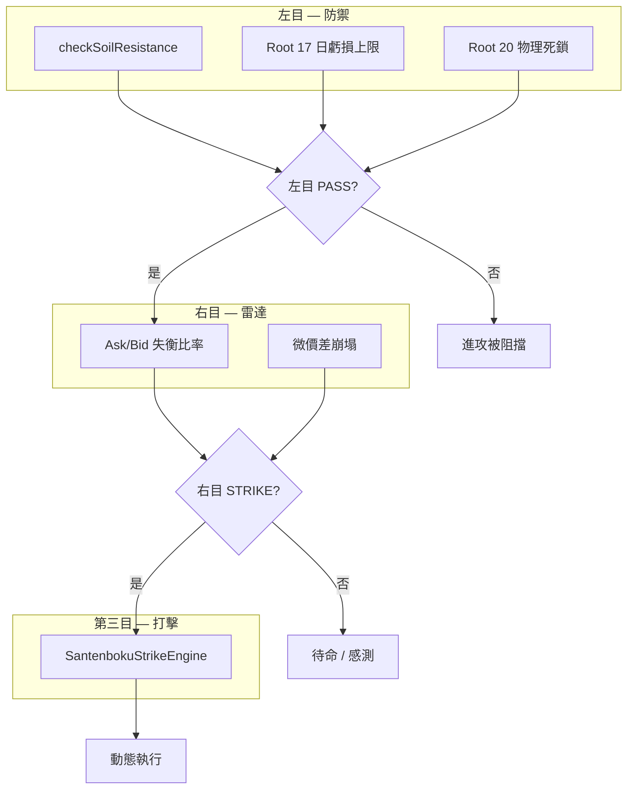
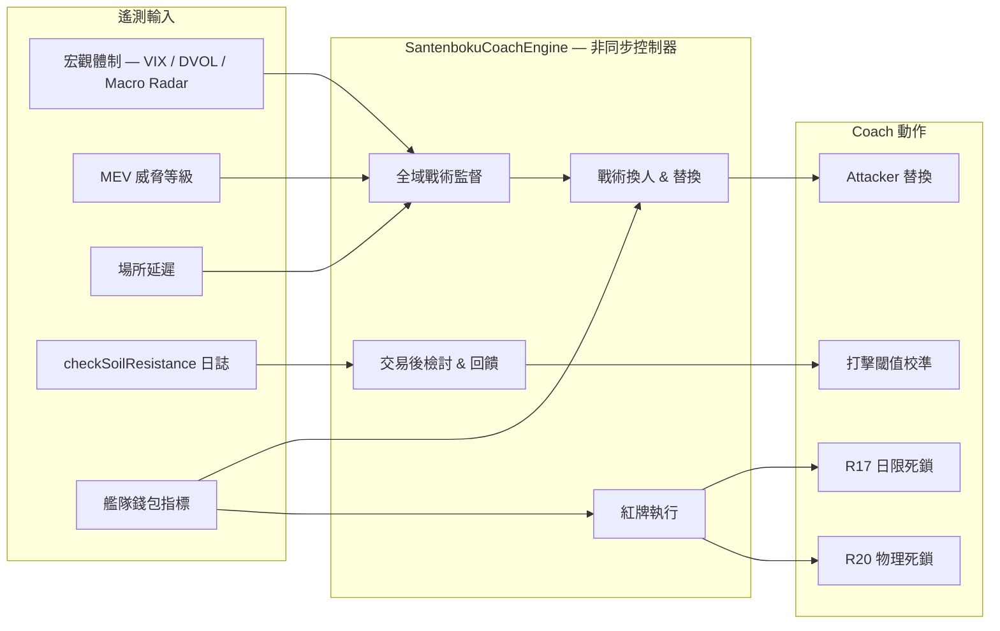

# SilverVine / Santenboku (v0.8) — 協議架構

**攻守一體 (Attack–Defense Integration Engine)**

Santenboku v0.8 在單一分層管線中統一防禦硬鎖與進攻打擊執行。防禦永遠優先執行；打擊邏輯受閘門控制，絕不繞過風險引擎。

---

## 系統邊界

| 層級 | 範圍 | 儲存庫暴露程度 |
|------|--------|---------------------|
| **Tier 0 — 公開 UI** | React SPA (`src/v2/`), terminal dashboard, matrix render | 完全開放 (BSL 1.1) |
| **Tier 1 — 風險引擎** | `checkSoilResistance`, `rootProtection`, Root 17 daily cap, CRI hardlock | 完全結構化、單元測試覆蓋 |
| **Tier 2 — Workers / 適配器** | Cloudflare Worker entry (`src/index.ts`), exchange adapters, matrix pipeline | 介面驅動、原生 fetch |
| **Tier 3 — Strike Alpha** | `SantenbokuStrikeEngine` sensing thresholds, fleet sizing, pit-stop params | **僅介面 + 執行期設定** — 敏感 alpha 參數透過環境變數注入，不提交至 git |
| **Tier 3b — Coach** | `SantenbokuCoachEngine` macro oversight, fleet substitutions, adaptive calibration | **僅介面 + 執行期設定** — 非同步控制器邏輯；儲存庫中不含錢包金鑰 |

機密資料 (`.dev.vars`, `.env`, private keys) 永不進入版本控制。生產環境數值透過 `wrangler secret put` 或部署範圍內的環境綁定設定。

---

## Santenmoku (三天目) 系統

三天目模型是任何進攻動作的標準決策流程。



### 1. 左目 — 土壤阻力 / 防禦

任何打擊被考慮之前，必須 **PASS**。

| 守衛 | 模組 | 行為 |
|-------|--------|----------|
| 土壤阻力 | `src/services/risk-control.ts` → `checkSoilResistance()` (土壤阻力 / 滑價斷路器) | 跨場所滑價、深度、HKT 海嘯護盾 |
| Root 17 | `src/v2/services/root17-daily.ts` → `checkRoot17DailyLimit()` | UTC 日累計虧損上限 (Effective Max SL × 3) 及每日最多 3 次 SL 觸發 |
| Root 20 | `src/services/risk-control.ts` → `rootProtection()` (根系防禦 / 物理死鎖) | 物理死鎖 — 動態 Max SL 突破或 CRI === 0 硬鎖 (HTTP 403) |

實作參考：`src/v2/services/trade-pipeline.ts` 中的 `resolveAttackLock()` 針對這些 root 強制執行客戶端進攻路徑。

### 2. 右目 — 失衡感測 / 雷達

即時進攻 **感測**（非執行）：

- **Orderbook Ask/Bid 失衡比率** — 偵測方向性流動性偏斜。
- **微價差崩塌 (Micro-Spread Collapse)** — 當 bid–ask 微價差壓縮至設定的基點下限以下時，標記流動性真空。

閾值 **不** 硬編碼於儲存庫。它們透過 `StrikeAlphaConfig`（見 `src/services/types.ts`）提供，於 Worker 啟動或測試注入時從執行期環境變數解析。

### 3. 第三目 — 反擊 / 打擊引擎

`SantenbokuStrikeEngine`（`src/services/santenboku-strike-engine.ts`）僅在以下條件下協調動態執行：

1. 左目 = **PASS**
2. 右目 = **STRIKE**（失衡 + 可選的微價差崩塌訊號）

引擎暴露純函式、可測試的介面；alpha 參數保持可注入。

---

## 體育戰術映射 (F1 進站 & 艦隊協作)

### 動態再平衡 (F1 Pit-Stop)

當資金費率或持倉時長變得不利的，系統支援 **飛行中倉位/保證金調整**，且不中斷執行連續性。進站參數 (`pitStopFundingBps`, `pitStopMaxHoldMs`) 可透過 `StrikeAlphaConfig` 在執行期設定。

### 聲紋 & 感測委託

在規模化打擊之前，引擎可能發出 **微感測委託**（探測名義金額、冷卻時間）以驗證顯示的流動性牆是否真實。假牆觸發打擊中止或縮減規模，而非盲目市價進場。

### 艦隊協作架構

多錢包艦隊執行是目標部署拓撲：

| 角色 | 職責 |
|------|----------------|
| **Attacker** | 主要打擊錢包 — 執行第三目訊號 |
| **Hedger** | Delta 中性對沖 / 不利成交時的基差避險 |
| **HL Lend Liquidity Vault** | Hyperliquid 借貸流動性儲備，供保證金進站使用 |

艦隊模式透過 `STRIKE_FLEET_MODE` 切換（見 strike alpha 環境解析）。錢包地址與簽名金鑰保留在儲存庫之外。

---

## 第 12 位球員：Santenboku Coach 引擎

**Coach 引擎** 是非同步的 **第 12 位球員** — 位於三天目打擊管線與艦隊協作名單之上的全域戰術控制器。它不直接執行委託；它觀察、建議、替換，並可發出 **紅牌 (Red Cards)** 以觸發物理死鎖。



### 全域戰術監督

Coach 以 **非同步控制器** 運行（排程 Worker alarm、佇列消費者或背景輪詢 — 不在熱執行路徑上）。它持續監控 **宏觀市場體制**：

| 訊號 | 來源 | Coach 回應 |
|--------|--------|----------------|
| 波動率飆升 | VIX / DVOL vs `CoachAlphaConfig` thresholds; Macro Radar DEFCON | 提升監督等級；收緊打擊閘門；替換掉激進 Attacker |
| MEV 威脅 | External threat level feed (`mevThreatLevel`) | 暫停第三目武裝；延長感測冷卻 |
| 場所延遲 | Per-adapter round-trip latency (`venueDelayMs`) | 繞過慢速場所；若 Attacker 綁定該場所則觸發替換 |

體制評估為純函式，可透過 `src/services/santenboku-coach-engine.ts` 中的 `evaluateMacroRegime()` 測試。閾值可透過 `COACH_*` 環境變數注入（見 `src/services/types.ts` 中的 `CoachAlphaEnv`）。

### 戰術換人 & 替換

當艦隊協作模式啟用時，Coach 管理 **活躍 Attacker 名單**，如同足球替補席：

| 觸發條件 | 閾值（預設） | 動作 |
|---------|---------------------|--------|
| 保證金使用率 | `marginUsageSubstitutionPct` > **80%** | 替換現任 Attacker；從艦隊池晉升下一個合格 Attacker |
| 持倉時長邊際衰減 | `holdingDurationMs` > `pitStopMaxHoldMs` **且** `edgeBps` < 0 | 在邊際轉為已實現虧損前替換 |
| 宏觀體制 CRITICAL | VIX/DVOL/MEV composite | 暫停所有替換；凍結新打擊 |

替換決策以 `CoachSubstitutionDecision[]` 形式輸出 — 僅含錢包 ID，絕不含簽名材料。Strike 引擎在下一個第三目週期前接收更新後的活躍 Attacker 槽位。

### 交易後檢討 & 回饋

每個執行窗口結束後，Coach 攝取來自 `checkSoilResistance()` (土壤阻力 / 滑價斷路器) 觸發與通過的結構化日誌 (`SoilResistanceLogEntry[]`)：

1. **觸發叢集** — 若跨場所滑價觸發在 `MAX_SLIPPAGE` 附近叢集，Coach 建議收緊右目感測。
2. **假通過漂移** — 若打擊成功但成交後滑價超過土壤預測，Coach 逐步提高 `imbalanceRatioMin`。
3. **校準輸出** — `calibrateStrikeThresholds()` 回傳 **部分** `StrikeAlphaConfig` 增量，於執行期套用（永不提交至 git）。

這在左目防禦遙測與第三目 alpha 之間閉合回饋迴路，且不繞過硬鎖。

### 紅牌執行

Coach 持有 **觸發 R17 / R20 物理死鎖的權限**，當 **全域艦隊指標** 跨越安全邊界時 — 獨立於任何單一錢包的左目檢查：

| 紅牌 | 條件 | 效果 |
|----------|-----------|--------|
| **R17** | Fleet aggregate `cumulativeDailyLossUsd` exceeds daily cap **or** fleet-wide SL count ≥ `MAX_DAILY_SL_COUNT` | 所有 Attacker 錢包觸發 `checkRoot17DailyLimit()` — HTTP 403 |
| **R20** | Fleet aggregate estimated loss exceeds dynamic Max SL **or** global CRI === 0 | `rootProtection()` (根系防禦 / 物理死鎖) 硬鎖 — 簽名通道被阻擋 |

紅牌發出由 `evaluateRedCard()` 評估。當 `issued: true` 時，Coach 在任何進一步第三目武裝之前，將死鎖狀態傳播至交易管線 (`resolveAttackLock`)。

### Coach ↔ Strike 整合

```
SantenbokuCoachEngine (async)
    │
    ├─► calibrateStrikeThresholds() ──► StrikeAlphaConfig patch (runtime)
    ├─► evaluateSubstitution()      ──► FleetWalletSlot active Attacker swap
    └─► evaluateRedCard()           ──► R17 / R20 physical deadlock
              │
              ▼
SantenbokuStrikeEngine (sync gate)
    └─► evaluateStrikeGate() — only when Coach has not issued Red Card
```

實作：`src/services/santenboku-coach-engine.ts` · 型別：`src/services/types.ts` · 測試：`tests/santenboku-coach-engine.test.ts`

---

## 後端分層 & 測試策略

```
src/
├── services/
│   ├── risk-control.ts          # Tier 1 — 防禦原語
│   ├── effective-max-sl.ts      # Tier 1 — 動態 Max SL 計算
│   ├── types.ts                 # Tier 3 — strike & coach 介面
│   ├── santenboku-strike-engine.ts  # Tier 3 — 打擊閘門（設定注入）
│   ├── santenboku-coach-engine.ts   # Tier 3b — coach 控制器（非同步監督）
│   └── exchanges/               # Tier 2 — 場所適配器
├── v2/services/
│   ├── root17-daily.ts          # Tier 1 — Root 17 追蹤器
│   └── trade-pipeline.ts        # Tier 1+2 — 進攻鎖編排
└── index.ts                     # Tier 2 — Worker 入口
```

- **Tier 1** 模組為純函式，行覆蓋率 ≥90%（`vitest` + `risk-control` 閾值）。
- **Tier 2** 適配器實作 `ExchangeAdapter`，保持 Workers 安全（無 Node 專用 SDK）。
- **Tier 3** strike alpha 隔離：介面在 git，調參數值在 `.dev.vars` / Wrangler secrets。
- **Tier 3b** Coach 非同步運行；艦隊替換與紅牌委派至 Tier 1 原語 (`checkRoot17DailyLimit`, `rootProtection`)。
- 流行文化戰術日誌別名 **僅供註解** — 見 [`POPCULTURE_TACTICS.md`](POPCULTURE_TACTICS.md) 與 `src/services/tactical-log-tags.ts`。

---

## 授權

本專案依 **Business Source License 1.1** 授權（見 [`LICENSE`](../LICENSE)）。

- 非商業用途、內部測試及 DEX Foundation Grant 審查，在 Additional Use Grant 下允許。
- **Change Date:** 2028-07-25 → 轉換為 **Apache-2.0**。
