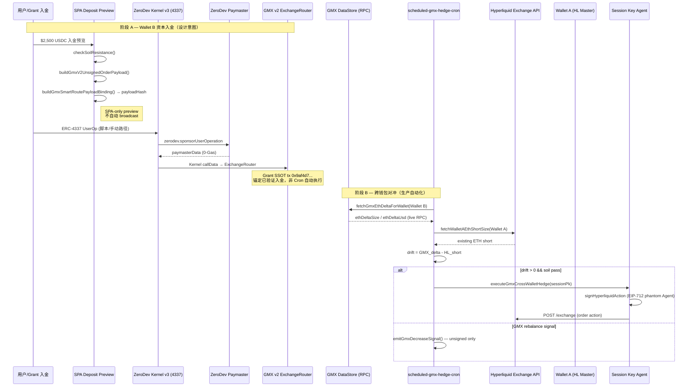
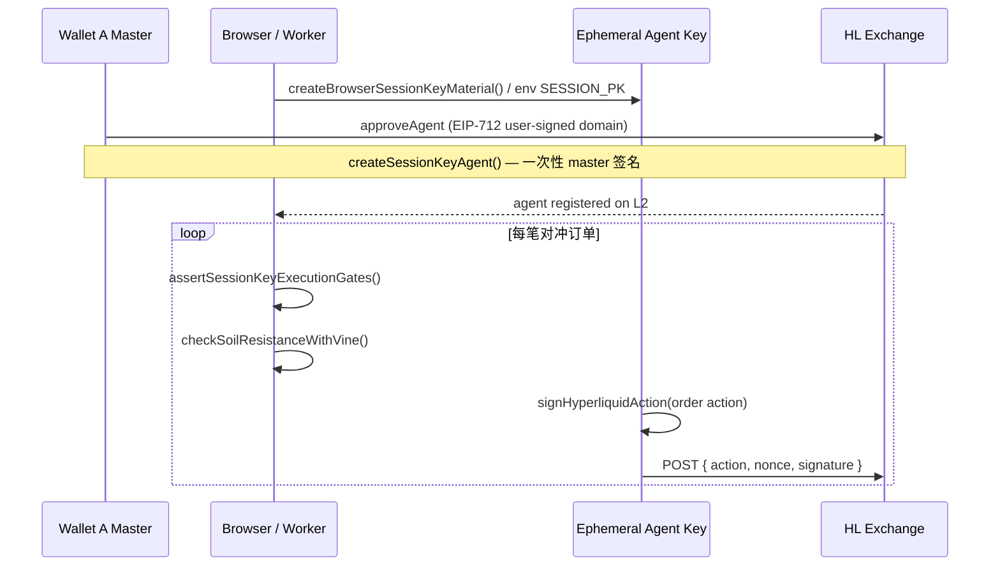

# 双钱包架构深度审计报告

## 执行摘要

| 维度 | 结论 |
|------|------|
| **Wallet B（Arbitrum / GMX）** | ZeroDev Kernel v3 + Paymaster 实现完整，但 **生产 Cron / Hedge 路径不调用 `sendZeroDevUserOp`**；GMX 侧以 **未签名 payload + `payloadHash` 绑定** 为主，链上 GM 入金锚点为 Grant SSOT 手工验证 tx，非 Worker 自动广播 |
| **Wallet A（HL Perps）** | **真实 HL EIP-712 签名 + Exchange POST** 路径存在且为生产 SSOT（`executeHlSessionKeyOrder`） |
| **ZeroDev ↔ HL 交互** | **零耦合**——两套独立签名域、独立密钥；仅通过 **链上 GMX delta 遥测 → HL 空头 sizing** 逻辑关联 |
| **Mock 残留** | 存在 **明确的 stub 层**（`stubSignSessionKeyPayload`），但 **不位于主对冲广播路径** |

---

## 1. 钱包角色与 SSOT 地址

| 角色 | 默认地址 | 代码 SSOT |
|------|----------|-----------|
| **Wallet A** — HL 1× ETH 空头对冲 | `0xef0752df6387248B897F3A59A180af42D801960d` | `HL_WALLET_A_DEFAULT`（`gmx-cross-wallet-hedge.ts`） |
| **Wallet B** — GMX GM LP / Protocol Treasury | `0xc9BddABD80982d2201376195DD9B85fb7951546f` | `GMX_WALLET_B_DEFAULT` = `GMX_UI_FEE_RECEIVER`（`gmx-revenue.ts`） |

**重要澄清**：Wallet B 在代码中是 **GMX uiFeeReceiver（+10 bps 协议金库）+ GM 持仓读取地址**，**并非** ZeroDev Kernel 合约地址。ZeroDev Kernel 地址由 `ownerPrivateKey` 确定性派生（`buildKernelAccount`），与 Wallet B 默认地址无硬绑定。

---

## 2. 端到端工作流（序列图）



---

## 3. Wallet B：ZeroDev AA + GMX 入金路径审计

### 3.1 ZeroDev AA 栈（真实实现）

| 模块 | 职责 | 生产可达性 |
|------|------|------------|
| `zerodev-aa-kernel.ts` | Kernel v0.3.1 + EntryPoint v0.7，`@zerodev/sdk` + `signerToEcdsaValidator` | ✅ 真实 |
| `zerodev-aa-userop.ts` | `buildUserOpDraft`、Paymaster middleware (`zerodev.sponsorUserOperation`) | ✅ 真实 |
| `zerodev-aa-send-userop.ts` | `createKernelAccountClient` → `sendUserOperation` → `waitForUserOperationReceipt` | ⚠️ **仅 `scripts/zerodev-testnet-userop.ts` 调用** |
| `zerodev-kernel-adapter.ts` | `buildKernelAccountWithRiskGate` — 上链 `SliverVineRiskOracle` fail-closed 门控 | ✅ smoke probe 使用 |

Paymaster 0-Gas 路径在 `sendZeroDevUserOp` 中明确：

```84:107:src/adapters/arbitrum/zerodev-aa/zerodev-aa-send-userop.ts
  const paymaster = sponsored
    ? createZeroDevPaymasterClient({ chain: input.chain, transport: http(bundlerRpc) })
    : null;
  // ...
  const userOpHash = await kernelClient.sendUserOperation({
    calls: [{ to: zeroAddress, value: 0n, data: "0x" }],
  });
```

**审计结论**：ZeroDev AA 基础设施完整且可广播，但 **Worker/Cron/E2E 主路径未 wired 到 GMX GM deposit calldata**。当前 smoke 脚本发送的是空 call（`zeroAddress`），非 GMX `createOrder`。

### 3.2 GMX v2 GM 入金（$2,500 USDC 叙事）

| 层级 | 行为 | 是否链上广播 |
|------|------|--------------|
| `buildGmxV2UnsignedOrderPayload` | 构建 `CreateOrderParams` 对齐的未签名结构 + `uiFeeReceiver` | ❌ 仅 payload |
| `buildGmxSmartRoutePayloadBinding` | `computeGatedExecutorPayloadHash` 绑定 Gate executor | ❌ 仅 hash |
| `smart-route-deposit-flow.ts` | SPA 预览：`soil → gate → payloadHash` | ❌ 明确注释 "SPA-only" |
| E2E Step 3 (`e2e-steps-early.ts`) | 构建 payload + sha256 引用 + builder fee 叙事 | ❌ 无 UserOp |
| `grant-mainnet-execution-ssot.ts` | 锚定 tx `0x9af4d722...`（Arbiscan 已验证） | ✅ **链外 SSOT 引用**，非代码自动执行 |
| `emitGmxDecreaseSignal` (Cron) | 减仓信号 payload | ❌ 注释 "no broadcast" |

```36:49:src/scheduled-gmx-hedge-lib/scheduled-gmx-hedge-cron.ts
/** Unsigned GMX MarketDecrease signal — liquidity un-stake / de-lever (no broadcast). */
export function emitGmxDecreaseSignal(input: {
  // ...
}): ReturnType<typeof buildGmxV2UnsignedOrderPayload> {
  return buildGmxV2UnsignedOrderPayload({ /* reduceOnly: true */ });
}
```

**$2,500 / $2,400 资本叙事**：来自 `grant-narrative-defaults.ts`（`GRANT_NARRATIVE_FALLBACK_ONLY`），经 `computeCapitalInvariantLedger()` 统一；mainnet live 模式有 guard 禁止静默 fallback（`capital-invariant-ledger-guards.ts`）。

### 3.3 Arbitrum Intent 签名（Citadel Gate）

- `verifyAgentIntent()` — SDK 8 维门控，用于 Virtuals / ElizaOS / Wayfinder 等 **Agent 插件**，非 GMX Cron 直接调用
- GMX 路径通过 `GatedExecutor.payloadHash` 绑定意图，而非在 Cron 内做 EIP-712 attestation

---

## 4. Wallet A：Hyperliquid EIP-712 Session Key 审计

### 4.1 两套 EIP-712 域（HL 专有，非 EVM 钱包链）

```7:30:src/adapters/hl/auth/domains.ts
/** L1 phantom-agent domain chain id — fixed by Hyperliquid, not wallet network */
export const HL_L1_CHAIN_ID = 1337;

/** EIP-712 domain for L1 exchange actions (phantom Agent) */
export const HL_EXCHANGE_DOMAIN: Eip712Domain = {
  name: "Exchange",
  version: "1",
  chainId: HL_L1_CHAIN_ID,  // ← 固定 1337，非 eth_chainId
  verifyingContract: HL_ZERO_ADDRESS,
};
```

| 签名类型 | Domain | 签名者 | 用途 |
|----------|--------|--------|------|
| **L1 Order Action** | `Exchange` / chainId **1337** | Session Key Agent PK | `order` / `cancel` 等 POST 到 HL Exchange |
| **approveAgent** | User-signed domain / `signatureChainId`（默认 `0x66eee` Arbitrum Sepolia） | Master Wallet (Wallet A) | 授权 ephemeral agent |

`signHyperliquidAction` 将 action 哈希为 `connectionId`，再签 phantom Agent：

```34:54:src/adapters/hl/auth/sign-action.ts
export async function signHyperliquidAction(
  signer: Eip712Signer,
  action: object,
  nonce: number,
  options: SignHyperliquidActionOptions = {},
): Promise<string> {
  assertSigningChannelOpen(options.gate);
  const agentMessage = buildExchangeAgentMessage({ action, nonce, ... });
  return signer.signTypedData(
    buildExchangeDomain(options.signatureChainId),
    HL_AGENT_TYPES,
    agentMessage,
  );
}
```

**非 EVM 兼容性**：HL L1 不是标准 EVM chain，但协议通过 **固定 chainId=1337 的 phantom EIP-712** 实现签名验证；Citadel 用 `viem`/`ethers` 的 `signTypedData` 适配，**不依赖钱包 `eth_chainId` 匹配 L1 domain**——这是 HL 官方设计，不会破坏 Workers/Node 无浏览器环境。

### 4.2 Session Key 生命周期



| 环境 | Session Key 来源 | 入口 |
|------|------------------|------|
| **Browser Live 5-TX** | `createBrowserSessionKeyMaterial` → sessionStorage | `orchestrateBrowserLive5Tx` |
| **Worker Cron / 生产对冲** | `HYPERLIQUID_MAINNET_SESSION_PK` / `SRV_200_MAINNET_SESSION_PK` | `createViemEip712Signer(sessionPk)` |
| **E2E Live Step 4** | `process.env` session PK + `dryRun: false` | `runGmxCrossWalletEthHedge` |

### 4.3 生产对冲主路径（真实广播）

```138:157:src/services/gmx-cross-wallet-hedge.ts
  const result = await executeHlSessionKeyOrder(leg, {
    signer,                    // viem EIP-712 signer (真实 PK)
    dryRun: !live,
    isTestnet: false,
    exchangeUrl: HL_EXCHANGE_URL,
    marketIoc: true,
    // ...
    sessionKey: sanitizeSessionKeyForMasterWalletTrading({ agentAddress: signer.address, masterWalletAddress: walletA }, walletA),
  });
```

调用链：

`executeHlSessionKeyOrder` → `executeSignedAction` → `signHyperliquidAction` → `postExchangeRequest`

- `dryRun: true`：签名但不 POST（E2E 默认）
- `dryRun: false` + `IS_MAINNET=true`：真实 HL 成交

Sizing 逻辑：**live GMX DataStore delta − Wallet A 现有空头 = 需补空单**，非静态 $160–190（legacy 已 deprecated）。

---

## 5. ZeroDev AA 与 HL Session Key 的交互关系

### 5.1 完全解耦

| | Wallet B (Arbitrum) | Wallet A (HL) |
|--|---------------------|---------------|
| **签名标准** | ERC-4337 UserOp + Kernel ECDSA | HL phantom EIP-712 (chainId 1337) |
| **密钥** | Kernel owner EOA | Master + ephemeral agent |
| **广播目标** | Arbitrum bundler / EntryPoint | `api.hyperliquid.xyz/exchange` |
| **Citadel 门控** | RiskOracle on-chain + soil (ingress) | `assertSessionKeyExecutionGates` + soil + R17/R20 signing channel |

**不存在**：
- 同一私钥签 UserOp 和 HL order
- ZeroDev Paymaster 赞助 HL gas（HL 无 EVM gas）
- UserOp calldata 触发 HL API

### 5.2 唯一的"跨钱包"逻辑纽带

```83:88:src/services/gmx-cross-wallet-hedge.ts
  const walletB = (input.walletB ?? GMX_WALLET_B_DEFAULT).trim();
  const delta = await fetchGmxEthDeltaForWallet(walletB, { fetchFn });
  const existingShort = await fetchWalletAEthShortSize(walletA, input.fetchFn);
  const uncovered = delta.ethDeltaSize - existingShort;
```

**遥测驱动**：读 Wallet B 链上 GM ETH delta → 在 Wallet A 补/减 HL 空头，实现 0-Δ cross-wallet hedge。

---

## 6. Mock / Stub 残留清单（与生产路径边界）

| 组件 | 位置 | 是否进入生产对冲广播 |
|------|------|----------------------|
| `stubSignSessionKeyPayload` | `session-key-eip712.ts` | ❌ 仅 `signAndExecuteOrder` + `hyperliquid-adapter` 格式校验 |
| `signAndExecuteOrder` | `session-key-sign-execute.ts` | ❌ Defense Matrix stub 层，注释 "Sign and execute (stub)" |
| `validateProductionSessionKeyBridge` | `hyperliquid-adapter.ts` | ⚠️ 用 stub 验签格式，再 delegate `executeOrder`（旧 bridge） |
| `executeHlSessionKeyOrder` | `session-key-executor/` | ✅ **生产 SSOT**，真实 `signHyperliquidAction` |
| E2E Step 3 GMX deposit | `e2e-steps-early.ts` | ❌ 叙事 + unsigned payload |
| E2E Step 4 默认 | `dryRun: true` | ❌ 不 POST HL |
| `runLegacyHlAutoHedge` | `hl-auto-hedge-legacy.ts` | ❌ 仅 `useLegacySizing: true`（测试） |
| `quoteRChainYieldToArbitrumGm` | robinhood router | ❌ 桥接报价预览 |
| Grant TVL SWR fallback | `dual-wallet-tvl-fallback.ts` | ❌ UI audit only，hedge sizing 被 `isGmxTelemetrySafeForSizing` 阻断 |
| `sendZeroDevUserOp` 空 call | testnet script | ❌ 非 GMX deposit 自动化 |

**结论**：双钱包 **对冲路由（Cron → cross-wallet hedge → HL POST）无 mock-only 逻辑**；但 **Wallet B 入金广播** 在代码层是 **preview + SSOT 锚定 tx**，非全自动化闭环。

---

## 7. 工作流验证清单

| # | 验证项 | 状态 |
|---|--------|------|
| 1 | ZeroDev Kernel v3 + EntryPoint v0.7 正确装配 | ✅ |
| 2 | 0-Gas Paymaster (`sponsorUserOperation`) 路径存在 | ✅（脚本级） |
| 3 | Risk Oracle on-chain gate 在 UserOp 构建前执行 | ✅ |
| 4 | GMX unsigned payload 与 `uiFeeReceiver` (Wallet B) 对齐 | ✅ |
| 5 | 生产 Cron 自动广播 GMX GM UserOp | ❌ **未 wired** |
| 6 | HL Session Key `approveAgent` EIP-712（master 签） | ✅ |
| 7 | HL L1 order EIP-712 phantom domain (chainId 1337) | ✅ |
| 8 | Workers 环境 viem signer 可签 HL typed data | ✅ |
| 9 | 生产 Cron 真实 POST HL exchange | ✅（需 `IS_MAINNET` + session PK） |
| 10 | GMX delta → HL short sizing 动态闭环 | ✅ |
| 11 | ZeroDev 与 HL 共享签名管道 | ❌ **设计为独立** |

---

## 8. 风险与差距（Un-masked）

1. **叙事 vs 自动化落差**：Grant 文档中的 $2,500 入金 + $2,400 GM deposit 在 E2E 中是 **ledger 常量 + unsigned payload**；链上证明依赖 `GRANT_GMX_GM_DEPOSIT_TX_HASH` 手工锚定，Cron 不会重放该 UserOp。

2. **双路径 HL 签名**：`session-key-adapter`（stub）与 `hl/session-key-executor`（真实）并存；新代码应只走后者。`hyperliquid-adapter.ts` 标记 `@deprecated`。

3. **Wallet B ≠ ZeroDev Kernel**：默认 Wallet B 是 treasury EOA；若产品叙事要求 "Wallet B = AA 账户"，需在文档/配置中显式绑定 `kernel.address`，当前代码未做此映射。

4. **GMX 减仓仅信号**：`emitGmxDecreaseSignal` 不广播，over-hedge unwind 走 HL `reduceOnly` 侧（`executeGmxCrossWalletUnwind`），GMX 侧 unstake 需人工或其他路径。

---

## 9. 建议后续（可选）

若需 **4/4 Happy Path 链上可复现**：
- 将 E2E Step 3 接入 `buildKernelUserOpDraft` + GMX `callData` + `sendZeroDevUserOp`（mainnet 需 bundler/paymaster env）
- 或在文档中明确区分 **"Verified Anchor Tx"** vs **"Automated Ingress Worker"**

---

**测试基线（上次已知）**：861 Vitest PASS · `tsc --noEmit` clean · E2E 4/4 dry-run OK。